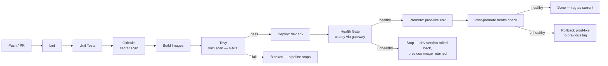

# Target Architecture — Secure, Reliable & Scalable Cloud Infrastructure Simulation for an AI Healthcare Platform

**Document type:** High-level target architecture (full project lifecycle, Phases 1–4)
**Primary source of truth:** `Project_Requirements_v2.0.pdf` ("Secure, Reliable & Scalable Cloud Infrastructure Simulation for an AI Healthcare Platform")
**Current implementation state referenced:** `PHASE1-RESULTS.md`, `PHASES.md`
**Audience:** Implementation agent ("OpenCode") and reviewers
**Status:** Phases 1–4 complete (Node.js 22 + Express running; hardening, pipeline, and observability/resilience proven — see `docs/SECURITY.md`, `docs/CICD.md`, `docs/INCIDENTS.md`, `docs/RESILIENCE.md`, `docs/SPOF.md`, `docs/DEMO.md`)

---

## 0. How to Read This Document

The PDF explicitly states the application layer is a **simulation** — the assessment is about **infrastructure and operations engineering**, not healthcare product features (PDF §2, §27, §26). Everything below is scoped accordingly: no frontend, no real AI, no real EHR integration, no real cloud spend, no real patient data.

One deviation from the PDF is carried forward deliberately and documented, not hidden: the PDF calls for a **relational database** (PDF §3, "Database"), but the project has adopted **MongoDB**. This is addressed head-on in Section 13.

The stack requested for this document (Node.js/Express, MongoDB, Redis, Docker/Compose, Nginx, Terraform-where-appropriate, GitHub Actions, Prometheus, Grafana, Trivy, Gitleaks, k6) is treated as the fixed technology decision. The PDF itself does not mandate specific tools (PDF §24) — it requires reasoned justification, which is provided throughout.

---

## 1. System Overview

The system simulates the infrastructure and operations layer of an AI-powered healthcare platform. The "product" is intentionally thin: a Patient/API service, an AI/Agent service, a Background Worker, a Queue, a Database, and a mocked External EHR. None of these implement real healthcare logic — they exist to generate realistic, observable, failure-prone operational behavior that the infrastructure must handle.

| Component | Purpose |
|---|---|
| **Nginx Gateway** | Single controlled public entry point; reverse proxy/API gateway; TLS termination point; hides all internal services from the internet |
| **API Service (Node.js/Express)** | Patient/API service from the PDF; accepts appointment/job requests, exposes health/readiness/metrics, enqueues async work, reads/writes MongoDB |
| **AI/Agent Service (Node.js/Express, mock)** | Simulated internal AI service; reachable only from the API/worker over the private network; demonstrates secret handling and isolation for an "AI provider" style dependency |
| **Worker Service (Node.js)** | Background processor; consumes the Redis queue; performs simulated appointment processing, notifications, EHR synchronization; the primary vehicle for demonstrating retries, failure, and recovery |
| **Redis** | Queue/broker for asynchronous work and buffering under load |
| **MongoDB** | Private datastore for appointments/jobs/workflow state (relational deviation documented in §13) |
| **Mock EHR Service** | Simulated external healthcare system; deliberately supports success, slow, timeout, 5xx/retryable, auth-failure, and unavailable response modes |
| **CI/CD Pipeline (GitHub Actions)** | Lint → test → secret scan (Gitleaks) → build → image scan (Trivy) → security gate → deploy dev → health gate → promote prod-like → rollback |
| **Observability Stack (Prometheus + Grafana)** | Metrics collection, dashboards, and alerting across API, worker, queue, DB, EHR, and deployment health |
| **Terraform (local/simulated)** | Declarative description of the "cloud-shaped" resources (networks, compose-equivalent resource graph, parameterized environments) so the conceptual jump to real cloud is small |
| **Docker Compose** | The actual local orchestrator/runtime for dev and prod-like environments |

The system runs entirely on a local Ubuntu host via Docker Compose. Terraform is used where it adds genuine value (parameterizing environment-shaped configuration, documenting the resource graph, and being the artifact that would map onto real cloud IaC later) rather than to orchestrate containers it cannot meaningfully provision locally.

---

## 2. High-Level Architecture Diagram

```mermaid
flowchart TB
    subgraph INTERNET["PUBLIC / INTERNET"]
        CLIENT["Client / Evaluator<br/>(curl, browser, k6)"]
    end

    subgraph DEVOPS["CI/CD (GitHub Actions) — separate control plane"]
        GH["GitHub Repo"] --> PIPE["Pipeline:<br/>lint → test → gitleaks →<br/>build → trivy(gate) →<br/>deploy dev → health gate →<br/>promote prod-like → rollback"]
    end

    subgraph HOST["UBUNTU HOST — Docker Compose"]
        subgraph PUBNET["public network (only gateway attached)"]
            NGINX["Nginx Gateway<br/>:8080 dev / :8081 prod-like<br/>ONLY published port"]
        end

        subgraph PRIVNET["private network (internal: true — no internet route)"]
            API["API Service<br/>Node.js/Express<br/>/health /ready /metrics"]
            AI["AI/Agent Service (mock)<br/>Node.js/Express"]
            WORKER["Worker<br/>Node.js<br/>(scalable, N replicas)"]
            REDIS[("Redis 7<br/>Queue")]
            MONGO[("MongoDB 7<br/>Private DB")]
            EHR["Mock EHR Service<br/>ok / slow / timeout /<br/>5xx / 401 / unavailable"]
        end

        subgraph OBS["Observability (private, admin-only exposure)"]
            PROM["Prometheus<br/>+ 9 alert rules"]
            GRAF["Grafana :3000/:3001<br/>127.0.0.1 admin-only"]
            AM["Alertmanager"]
            PG["Pushgateway<br/>(pipeline status)"]
            REXP["redis-exporter"]
            MEXP["mongodb-exporter"]
            NEXP["nginx-exporter"]
        end
    end

    subgraph EXT["Simulated External Boundary"]
        EHRNOTE["Represents a real EHR network<br/>(mocked in-cluster, treated as external trust boundary)"]
    end

    CLIENT -->|HTTPS/HTTP, rate-limited| NGINX
    NGINX -->|proxy_pass| API
    API -->|internal REST| AI
    API -->|enqueue job| REDIS
    API -->|read/write app state| MONGO
    WORKER -->|dequeue job| REDIS
    WORKER -->|write results| MONGO
    WORKER -->|sync call, retries+backoff| EHR
    EHR -.->|represents crossing trust boundary| EHRNOTE
    API -.->|scrape /metrics/prom| PROM
    WORKER -.->|scrape /metrics/prom| PROM
    NGINX -->|stub_status| NEXP -.->|scrape| PROM
    REDIS -->|scrape| REXP -.->|scrape| PROM
    MONGO -->|scrape| MEXP -.->|scrape| PROM
    PIPE -->|push run status| PG -.->|scrape| PROM
    PROM --> AM
    PROM --> GRAF

    PIPE -->|build & push image, then deploy| HOST
    PIPE -.->|health check via gateway before promote| NGINX

    style PUBNET fill:#2d1a1a,stroke:#c0392b
    style PRIVNET fill:#1a2d1a,stroke:#27ae60
    style OBS fill:#1a1a2d,stroke:#2980b9
    style DEVOPS fill:#2d2a1a,stroke:#d4ac0d
```



**Reading the diagram:** the red boundary is the only network segment with a published host port. Everything green is on Docker's `internal: true` network — it has no route to the internet and is unreachable except from other containers on that network. The gateway is the sole bridge between red and green. Observability and CI/CD are drawn as separate control planes that reach into the host to scrape metrics or perform deploys/health checks, never to serve public traffic directly.

---

## 3. Service Responsibilities

### Nginx Gateway
- **Responsibility:** Sole public ingress; reverse proxy to API; rate limiting; TLS termination point (self-signed/local cert acceptable in simulation); hides internal topology.
- **Technology:** Nginx (official image), config as code in repo.
- **Network visibility:** Attached to both `public` and `internal` networks; only service with a published host port (8080 dev / 8081 prod-like).
- **Inputs/outputs:** In: client HTTP(S). Out: proxied requests to `api:3000` on the internal network only.
- **Dependencies:** API service healthy (upstream).
- **Health checks:** `GET /nginx-health` (static) plus upstream health via `proxy` error handling.
- **Failure behavior:** Returns 502/503 if API is unreachable; does not crash the whole stack; restart policy `on-failure`.

### API Service (Node.js/Express)
- **Responsibility:** Public-facing "Patient/API service" per PDF §3; accepts appointment/job creation and listing; exposes `/health` (liveness), `/ready` (DB+queue dependency check), `/metrics` (Prometheus format); enqueues jobs; calls AI service for simulated agent interaction.
- **Technology:** Node.js 22 + Express; MongoDB driver (`mongodb` 6.21.0); `ioredis` client (metrics are JSON via `/metrics`).
- **Network visibility:** Internal network only; reached exclusively via the gateway.
- **Inputs/outputs:** In: HTTP from Nginx. Out: MongoDB reads/writes, Redis enqueue, internal HTTP to AI service.
- **Dependencies:** MongoDB, Redis, AI service (soft dependency — degrades, does not hard-fail on AI outage).
- **Health checks:** `/health` = process up; `/ready` = Mongo ping + Redis ping both succeed.
- **Failure behavior:** If Mongo/Redis unreachable, `/ready` returns 503 (removes from rotation conceptually); API stays up for liveness so orchestrator doesn't restart-loop it; requests fail fast with 503 rather than hanging.

### AI/Agent Service (mock, Node.js/Express)
- **Responsibility:** Simulated internal AI service called by the API; demonstrates secret handling (mock "API key" pulled from environment/secret store, never logged) and service isolation.
- **Technology:** Node.js/Express, no external calls (fully mocked responses, optionally simulated latency).
- **Network visibility:** Internal network only; never exposed via gateway routes intended for the public API surface (may be reachable through gateway only on an explicit internal-debug path if needed, otherwise not routed at all).
- **Inputs/outputs:** In: internal HTTP from API/worker. Out: mock structured response.
- **Dependencies:** None (stateless mock).
- **Health checks:** `/health`.
- **Failure behavior:** API treats AI failures as non-fatal (timeout + fallback response), logged and counted as a metric.

### Worker Service (Node.js)
- **Responsibility:** Background/async processing (PDF §3 "Background Worker"): dequeues jobs from Redis, simulates appointment processing/notifications/EHR sync, writes results to MongoDB, retries on transient failure.
- **Technology:** Node.js consumer process (e.g., BullMQ on Redis, or a lightweight custom queue consumer); horizontally scalable via `--scale worker=N` (Compose) / replica count (Terraform-described).
- **Network visibility:** Internal network only; no inbound public exposure at all.
- **Inputs/outputs:** In: jobs from Redis. Out: writes to MongoDB, outbound calls to Mock EHR.
- **Dependencies:** Redis (hard), MongoDB (hard), Mock EHR (soft — retried, not fatal to the worker process).
- **Health checks:** `/health` on a small internal metrics/health port (liveness only — "is the process alive and consuming").
- **Failure behavior:** On crash/stop, jobs remain queued in Redis (not lost); on restart, worker resumes consuming and queue drains; EHR failures trigger retry/backoff, not job loss; poison jobs move to a dead-letter concept after N retries (documented, simple implementation acceptable).

### Redis
- **Responsibility:** Queue/broker for async jobs; buffers load spikes between API and worker.
- **Technology:** Redis 7 (official image).
- **Network visibility:** Internal network only; **never** publicly exposed.
- **Inputs/outputs:** In: enqueue from API. Out: dequeue by worker(s).
- **Dependencies:** None.
- **Health checks:** `redis-cli ping` container healthcheck; exporter for Prometheus (`queue depth`, `ops/sec`).
- **Failure behavior:** If Redis is down, API `/ready` fails (fast 503) and enqueue attempts fail loudly rather than silently dropping jobs; worker `/health` reports degraded.

### MongoDB
- **Responsibility:** Private application datastore representing hospitals/doctors/patients/appointments/workflow state (PDF §3 "Database" — see §13 for the relational-vs-document deviation).
- **Technology:** MongoDB 7 (official image), `db/mongo-init.js` bootstrap, named volume for persistence.
- **Network visibility:** Internal network only; **never** publicly exposed; no direct host port mapping in any environment.
- **Inputs/outputs:** In/out: reads/writes from API and Worker only.
- **Dependencies:** None (leaf datastore).
- **Health checks:** `mongosh --eval "db.adminCommand('ping')"` container healthcheck; exporter for Prometheus.
- **Failure behavior:** API/worker `/ready` fail fast; data durability relies on the named volume + backup/restore procedure (§9, §19).

### Mock EHR Service
- **Responsibility:** Simulated "External EHR / Healthcare System" (PDF §3); must support ok, slow, timeout, retryable 5xx, auth-failure (401), and unavailable modes so the worker's retry/timeout logic is genuinely exercised.
- **Technology:** Node.js/Express with a controllable response-mode switch (env var or per-request header, for demo purposes).
- **Network visibility:** Internal network only — represents an **external** system logically, but is deployed inside the private network for the simulation, with the trust boundary documented rather than physically implemented (explicit deviation, consistent with "simulation only," PDF §5).
- **Inputs/outputs:** In: HTTP from worker. Out: mock response per configured mode.
- **Dependencies:** None.
- **Health checks:** `/health`.
- **Failure behavior:** Deliberately unreliable by design; this is the fault-injection point for PDF §23 "External Dependency Failure."

### Prometheus / Grafana
- **Responsibility:** Metrics scraping, storage, dashboarding, alert rule evaluation (Phase 4).
- **Technology:** Prometheus + Grafana (official images), exporters for Mongo/Redis.
- **Network visibility:** Internal network; Grafana UI reachable only via an admin-only path (not the public gateway route used by patients/clients), or via a separate local-only port bound to `127.0.0.1` — never generally public.
- **Dependencies:** Scrapes API, worker, Nginx, Redis-exporter, Mongo-exporter.
- **Health checks:** Own container healthchecks; Prometheus `up{}` metric is itself the health signal for every scraped target.
- **Failure behavior:** Observability outage must not affect the application data plane; alerting on Prometheus/Grafana's own availability is a P2, not blocking.

### CI/CD Pipeline (GitHub Actions)
- **Responsibility:** Move code from commit to a running, verified deployment safely; enforce security gates.
- **Technology:** GitHub Actions (free tier) or an equivalent local `pipeline.sh` fallback if runner minutes are constrained.
- **Network visibility:** N/A (control plane, not part of the runtime network).
- **Dependencies:** Access to build the images, push to a registry (or build locally for Compose), and reach the dev/prod-like host to deploy + health-check.
- **Health checks:** The pipeline itself gates on the target environment's `/ready` via the gateway before promoting.
- **Failure behavior:** Any stage failure (lint/test/secret-scan/image-scan/health-gate) halts the pipeline before the next stage; previous healthy deployment is left untouched (§7, §12).

---

## 4. Network Architecture

**Public network** (`public`, Docker bridge network, Nginx published to host):
- Contains only the Nginx gateway.
- Host port published: **8080** (dev), **8081** (prod-like). This is the only host-published port in the entire system.

**Private/internal network** (`internal`, Docker network with `internal: true` — no default route to the internet):
- Contains: API, AI service, Worker, Redis, MongoDB, Mock EHR, Prometheus, Grafana, exporters.
- No service on this network can be reached from outside the Docker host network stack, and (with `internal: true`) containers on it cannot reach the public internet either — outbound calls the worker makes to the Mock EHR stay entirely inside this network, which is the correct simulation of "controlled outbound communication" (PDF §9).

**Which services can talk to which:**

| From \ To | Nginx | API | AI | Worker | Redis | Mongo | EHR(mock) | Prometheus |
|---|---|---|---|---|---|---|---|---|
| Client (internet) | ✅ | ❌ | ❌ | ❌ | ❌ | ❌ | ❌ | ❌ |
| Nginx | — | ✅ | ❌ | ❌ | ❌ | ❌ | ❌ | ❌ |
| API | — | — | ✅ | ❌ | ✅ | ✅ | ❌ | (scraped by) |
| Worker | — | ❌ | ❌ | — | ✅ | ✅ | ✅ | (scraped by) |
| Prometheus | — | scrape | ❌ | scrape | scrape(exp) | scrape(exp) | ❌ | — |

**Never publicly exposed:** MongoDB, Redis, the AI service, the Worker, the Mock EHR, Prometheus, and Grafana (Grafana only via an admin-restricted path, not the client-facing route). This directly satisfies PDF §8 ("only components that genuinely require internet-facing access should be exposed publicly") and §11 ("public exposure of private resources" as a flagged risk).

**Gateway routing:** Nginx exposes only API routes (`/api/*`, `/health`, `/ready`, `/metrics` if intentionally public for the demo, otherwise metrics kept admin-only). It does not proxy to the AI service, worker, DB, queue, or EHR mock under any path.

**Simulated external EHR boundary:** the Mock EHR container is physically on the internal network (simulation constraint) but is architecturally treated as if it sits across a trust boundary — the worker talks to it the same way it would talk to a real external system (timeouts, retries, circuit-breaking, no shared credentials with internal services), and this deviation is called out explicitly rather than implied.

---

## 5. Data / Message Flow

1. **Normal API request:** Client → Nginx (rate-limited, TLS-terminated) → API → Mongo (read) → response back through Nginx to client.
2. **Appointment/job creation:** Client → Nginx → API validates payload → API writes an initial record to Mongo (status `pending`) → API pushes a job onto the Redis queue → API returns `202 Accepted` with the job/appointment id immediately (does not block on processing).
3. **Queue processing:** Worker polls/consumes Redis → picks up job → marks record `processing` in Mongo.
4. **Worker processing / AI interaction:** Worker may call the AI service for a simulated decision/enrichment step (e.g., "suggest scheduling slot") → non-fatal on failure, logged and retried a bounded number of times.
5. **EHR interaction:** Worker calls Mock EHR to simulate sync → on success, marks record `completed`; on slow/timeout, worker respects a request timeout and retries with backoff; on 5xx, retried as transient; on 401, treated as non-retryable (marks `failed_auth`, alertable); on "unavailable," circuit-breaks after N consecutive failures to avoid hammering a down dependency.
6. **Retry/failure flow:** Failed jobs are retried with exponential backoff up to a max attempt count; after exhausting retries, the job is marked `failed` in Mongo and (conceptually) moved to a dead-letter list in Redis for operator inspection — nothing is silently dropped.
7. **Worker failure and recovery:** If the worker process is killed/stopped, in-flight and queued jobs simply remain in Redis (not lost, not acknowledged) — this is the exact behavior already validated in Phase 1 (`PHASE1-RESULTS.md`: queue stuck at 10 while stopped, drained to 0 on restart). On worker restart (manual in Compose, `restart: on-failure` policy), consumption resumes automatically.
8. **Database persistence:** All appointment/job state changes are persisted to MongoDB immediately on transition (not batched in memory), so a `docker compose down/up` cycle does not lose completed work — already demonstrated in Phase 1 (31 appointments persisted across recreate).

---

## 6. Security Architecture

Mapped directly to PDF §9–§11.

- **Secrets:** `.env` files (git-ignored) for local simulation, one per environment (`dev`, `prod-like`); never committed; never baked into images; never logged. Gitleaks (Phase 2) scans the repo and CI diff for accidental commits. In a real-cloud evolution this maps to a managed secret store (e.g., Vault/SSM) — noted as a future step, not built.
- **Environment configuration:** Environment-specific values (`MONGODB_URI`, `REDIS_URL`, ports, resource limits) live in per-environment env files / Compose overrides, not duplicated infrastructure definitions (satisfies PDF §7).
- **Non-root containers:** All custom images (API, AI, worker, EHR mock) run as a non-root `USER node` (or equivalent) in the final image layer; verified by a Phase 2 audit step.
- **Least privilege:** Each service only has the network reachability and credentials it needs — e.g., the AI mock has no DB credentials at all; the worker has DB + Redis + EHR reachability but no direct public exposure; CI/CD credentials are scoped to build/deploy only, not to production data access.
- **Network isolation:** Enforced via the `public`/`internal` Docker network split with `internal: true`, as detailed in §4.
- **Image scanning:** Trivy scans all built images in CI (Phase 2/3) for known CVEs. Phase 3 split the verdict: HIGH/CRITICAL findings in **app dependencies** (`lang-pkgs`: express, mongodb, ioredis) **block** the pipeline via `scripts/trivy-gate.sh`; the Debian OS-layer findings (52 HIGH / 4 CRITICAL, no upstream fix — accepted baseline, `docs/SECURITY.md` R1) are reported but non-blocking. Base images are digest-pinned (Phase 3, closes R5).
- **Secret scanning:** Gitleaks runs against the repository and CI diffs; a discovered secret blocks the pipeline (demonstrated with a seeded fake key in Phase 3 — `docs/CICD.md` §7).
- **Dependency/security scanning:** `npm audit` (or equivalent) integrated as an additional lint/test-stage check; Trivy also covers OS-level and dependency-level image vulnerabilities.
- **CI/CD security gates:** Secret scan and image scan are non-optional stages positioned **before** deploy; a failure at either stage halts the pipeline — this is the PDF §12 "at least one meaningful security failure must be demonstrated" requirement.
- **Deployment protection:** Health-gated promotion (§7) — an unhealthy new version never replaces a healthy running version.
- **Auditability:** Git commit SHA + image tag = deployed version; CI run logs record who/what triggered a deploy, which checks ran and their results, and whether promotion occurred — satisfying PDF §21 without needing a real IAM system (documented as a simulated-equivalent in Phase 1 results already).

---

## 7. CI/CD Architecture



Stages map directly to PDF §12–§13: validation → testing → security checks → build → vulnerability scan (gate) → deploy dev → health verification → promotion to production-like → rollback on failure, with versioned image tags throughout (git SHA or semver tag) so any deployed state is traceable back to source.

**Phase 3 implementation (proven, see `docs/CICD.md`):** two twin artifacts — `.github/workflows/pipeline.yml` (CI definition, `github.sha` tags) and `scripts/pipeline.sh` (locally executed equivalent; the demonstrated artifact). Both call `scripts/security-scan.sh` as-is, add the binding `scripts/trivy-gate.sh` app-dependency gate on newly built images, tag every image with the run tag (SHA when available), snapshot the previous tag per environment before deploying, and roll back to it on any post-build failure. Demonstrated: healthy rollout to dev + prod-like, a seeded-secret security block (pre-deploy), and an unhealthy-deploy rollback with the previous version verified serving. A deliberately broken tag never reaches prod-like.

---

## 8. Observability Architecture

| Signal | Source | Collected by | Shown in |
|---|---|---|---|
| Application logs | API, worker, AI, EHR mock (stdout, JSON structured) | Docker logging driver (Phase 1–3); optional Loki (Phase 4, optional per PHASES.md) | `docker compose logs`, optionally Grafana/Loki panel |
| Infra/container logs | Docker daemon, container events | Docker logging driver | `docker compose logs` |
| Metrics | `prom-client` in API/worker, Nginx stub_status, Redis/Mongo exporters | Prometheus scrape | Grafana |
| Queue depth | Redis exporter | Prometheus | Grafana panel + alert |
| API health | `/health`, `/ready` | Prometheus `up{}` + custom probe | Grafana panel + alert |
| Worker health | `/health`, active-consumer metric | Prometheus | Grafana panel + alert |
| Database health | Mongo exporter, `/ready` composite | Prometheus | Grafana panel + alert |
| EHR health | Worker-reported call outcome metrics (success/slow/timeout/error rate) | Prometheus | Grafana panel + alert |
| Deployment health | CI/CD health-gate result, deployed version label | CI job output / a `deployment_info` metric exposed by API | Grafana panel (annotation) |
| Alerts | Prometheus Alertmanager rules | — | Notification (console/log/webhook — free-tier appropriate) |

This satisfies PDF §16 (logging, metrics, health checks, operational dashboard) and §17 (alerting on API unavailability, high error rate, worker failure, queue backlog, DB unavailability, deployment failure) — **implemented in Phase 4**: `/metrics/prom` text endpoints on api/worker, nginx stub_status, redis/mongo/nginx exporters, Pushgateway for pipeline status, provisioned Grafana dashboard (17 panels), 9 Alertmanager rules with runbook annotations.

---

## 9. Resilience / Failure Architecture

| PDF Scenario | Behavior |
|---|---|
| Increased load | Redis buffers the spike between API and worker; API stays responsive by enqueueing rather than processing synchronously; `--scale worker=N` absorbs backlog; k6 used to generate and measure the load (§10). |
| Worker failure | Jobs remain queued in Redis (not lost); `restart: on-failure` brings the worker back; queue drains on recovery — already validated in Phase 1. |
| EHR failure | Timeout + retry/backoff in the worker; after N failures, circuit-breaks to avoid hammering; job marked `failed`/`retrying` rather than the worker crashing. |
| Unhealthy deployment | CI/CD health gate (§7) prevents promotion; previous healthy version keeps serving traffic. |
| Failed deployment | Same gate — deploy halts before the unhealthy version reaches prod-like; rollback restores the last known-good image tag. |
| Infrastructure recovery | `docker compose down && up` recreates all stateless services from IaC; stateful services (Mongo) recover from the named volume; a documented `terraform destroy/apply`-equivalent recreates the conceptual resource graph. |
| Backup/recovery | `mongodump`/`mongorestore` scheduled/manual procedure against the Mongo volume; documented RPO/RTO expectations for the simulation (not enterprise-grade, explicitly scoped as such per PDF §19). |

---

## 10. Scaling

- **API scaling:** Stateless Express process; horizontally scaled via `docker compose up --scale api=N`; Nginx upstream is the load-distribution point (Phase 1 noted static DNS resolution as a limitation to revisit in Phase 3 with an Nginx `resolver` directive for dynamic upstream discovery).
- **Worker scaling:** Stateless consumer; scaled via `--scale worker=N`; more workers simply means more concurrent queue consumers — directly validated in Phase 1 (`--scale api=2 --scale worker=2`).
- **Queue-based buffering:** Redis decouples producer (API) rate from consumer (worker) rate, so bursts don't overwhelm processing — this is the core mechanism that lets the simulation demonstrate "increased workload" gracefully (PDF §23).
- **Load testing:** k6 scripts (`k6/smoke.js`, `k6/load.js`) drive synthetic load against the gateway. Phase 4 measured: normal 588 req/0 fail avg 11 ms p95 40 ms; increased 569 req/0 fail avg 7 ms p95 17 ms with API latency independent of backlog; drain ~3 jobs/s per worker, ~6.7/s with two workers; QueueBacklog alert fired and resolved during the runs (`docs/RESILIENCE.md`).
- **Future autoscaling equivalent:** Documented conceptually — in real cloud this maps to an ASG/HPA reacting to queue depth or CPU; locally, this is represented as a manual scaling knob plus a note in the architecture doc explaining what the automated trigger *would* be (queue depth threshold → scale worker replicas).

---

## 11. Environments

| Aspect | Development | Production-like |
|---|---|---|
| Compose file | Base `docker-compose.yml` + `docker-compose.dev.yml` override | Base `docker-compose.yml` + `docker-compose.prod.yml` override |
| Host port | 8080 | 8081 |
| Env file | `.env.dev` | `.env.prod` |
| Credentials | Dev-only Mongo/Redis creds | Separate prod-like creds (still local/simulated, never shared with dev) |
| Resource limits | Loose/none | Defined CPU/memory limits (cost-awareness demo, §14) |
| Log verbosity | Verbose/debug | Info/warn |
| Scale defaults | 1 replica each | 2+ replicas for api/worker |

Both environments **share** the same base Compose service definitions, Dockerfiles, and application images — only environment-specific overrides and secrets differ, per PDF §7 ("without unnecessarily duplicating the entire infrastructure definition"). This is already the pattern validated in Phase 1.

---

## 12. Infrastructure as Code

| Artifact | Role | Version-controlled? |
|---|---|---|
| `docker-compose.yml` + env overrides | Primary runtime IaC for the simulation | Yes |
| `Dockerfile` per service | Reproducible image builds, non-root, minimal base | Yes |
| `db/mongo-init.js` | DB bootstrap/init as code | Yes |
| `nginx/*.conf` | Gateway routing as code | Yes |
| `terraform/` (local/simulated modules) | Declarative description of the resource graph (networks, service definitions, environment variables as Terraform variables) — used to document and parameterize the "cloud-shaped" resources and to make the conceptual jump to real Terraform-on-a-real-cloud small, even though `docker compose` remains the actual local execution engine | Yes |
| `.github/workflows/*.yml` | CI/CD pipeline definition | Yes |
| `k6/*.js` | Load test scripts | Yes |
| `monitoring/prometheus.yml`, `monitoring/grafana/*` | Observability config as code | Yes |
| `.env.*` | **Not** committed (secrets); `.env.*.example` committed instead | Example only |

Terraform's role here is explicitly scoped: it is not required to (and will not) provision real cloud resources. It is included because the PDF explicitly permits Terraform "where appropriate for IaC/simulation" and because expressing the environment/resource graph declaratively is valuable documentation and a straightforward on-ramp to a real deployment later — this is called out plainly rather than overstated.

---

## 13. Database Decision (Explicit Deviation)

- **PDF requirement:** §3 states "**A relational database** should represent application state such as hospitals, doctors, patients, appointments, scheduling state, workflow state, and integration state."
- **Current decision:** MongoDB 7 is used instead of a relational database (PostgreSQL was the original Phase-1 baseline; it was replaced per explicit instruction — see `PHASE1-RESULTS.md`).
- **Reason for retaining MongoDB:** The requirements document repeatedly emphasizes that the assessment is about **infrastructure and operations engineering**, not data modeling or schema design (PDF §2, §27). The complete healthcare data model is explicitly **not required** (PDF §3, "Database"). MongoDB satisfies every infrastructure-relevant property the PDF actually tests — it is a private, stateful, network-isolated, persistable, backup-able service with health checks — while the specific choice of document vs. relational storage does not change any of the network, security, CI/CD, observability, or resilience behavior being assessed.
- **Implications/trade-offs:** No foreign-key referential integrity or relational query optimizer; application-level consistency must be enforced in code; MongoDB's official image is SSPL-licensed (acceptable for local/free simulation use per Phase 1 notes, but not OSI-approved — flagged if a strictly OSI-licensed stack is ever required); schema flexibility trades off against the PDF's implied structured entity model (hospitals/doctors/patients/appointments).
- **What would change if PostgreSQL were introduced later:** Swap the `mongo` service for `postgres` in Compose/Terraform variables; replace the MongoDB driver/Mongoose layer with a SQL client/ORM (e.g., `pg` + Prisma/Knex); replace `db/mongo-init.js` with SQL migration files; update health checks (`pg_isready` vs. `mongosh ping`) and the Mongo Prometheus exporter with a `postgres_exporter`; no change required to networking, gateway, queue, CI/CD, or observability architecture, since the database's *infrastructure role* (private, internal-only, health-checked, backed up) is identical either way. This isolation of the deviation to a single, swappable component is itself evidence the architecture is not built around the database engine.

This deviation is treated as a documented, reasoned engineering trade-off — not a silent substitution — consistent with the instruction to never hide it.

---

## 14. Architectural Trade-offs

- **Local Docker Compose vs. real cloud:** No real load balancer, no managed autoscaling, no multi-AZ/region redundancy, no managed secret store, no real IAM. Each is mapped conceptually (Nginx ≈ ALB/ingress; `--scale` ≈ ASG/HPA; env files ≈ SSM/Vault; Docker network isolation ≈ VPC/subnet/security-group boundaries) so the simulation is honest about what it approximates rather than claiming equivalence.
- **Single-host simulation:** All containers run on one Ubuntu host, so a true "instance failure" cannot be demonstrated the way it would be in a multi-node cluster — container-level failure (stop/kill) is used as the closest faithful analog, and this substitution is stated explicitly rather than implied.
- **Nginx static upstream DNS:** Noted in Phase 1 as a real limitation when scaling API replicas; carried forward to Phase 4 (a `resolver` directive or dynamic upstream mechanism) — until then, scaling is functional but requires a gateway reload for topology changes.
- **MongoDB SSPL licensing:** Acceptable for this free/local simulation; flagged as a swap-candidate if a strictly OSI-licensed stack is later required (see §13).
- **No autoscaler:** Manual `--scale` stands in for real autoscaling; the trigger logic that *would* drive an HPA (queue depth > 15, the QueueBacklog alert threshold) is now wired as an alert, but scaling action stays manual — accepted scope boundary for a Compose simulation.
- **Cost awareness (PDF §22):** Everything used is free/open-source/self-hosted — no line item ever accrues cloud spend. Measured in Phase 4 (`docs/RESILIENCE.md` §5, `docs/SPOF.md` §3): dev idles < 400 MB RAM, monitoring adds ~150 MB, retention capped at 7 d / 1 GB; each worker buys ~3 jobs/s (linear). Host disk (94% full at Phase 4 start) is the binding constraint — prune old image tags.
- **Nginx static upstream DNS — measured, not just flagged:** `--scale api=2` sent 60/60 test requests to one replica (`docs/RESILIENCE.md` §4). Remediation (`resolver` + variable `proxy_pass`, or real ingress) is future work; until then scale workers, not the API.
- **Internal networks swallow published ports:** containers attached only to an `internal:true` network cannot publish host ports (binding silently dropped — verified). Grafana and nginx-exporter are therefore dual-net like `api`; their exposure stays localhost-bound / unpublished (`docs/SPOF.md` §4b).
- **Audit trail is simulated:** Git history + image tags + CI logs stand in for a real audit system like CloudTrail; sufficient for the assessment's purpose (traceability of who/what/when) but explicitly not enterprise-grade.

---

## 15. Phase Mapping

| Phase | Scope | Status |
|---|---|---|
| **Phase 1 — Foundation simulation** | Services + gateway + MongoDB + Redis + public/private networks + dev/prod-like envs + health/metrics endpoints + smoke & workload tests + base architecture docs | **Done** (re-validated after the Node.js 22 + Express migration — see §18, `docs/MERN-MIGRATION.md`) |
| **Phase 2 — Hardening + security validation** | Non-root audit, minimal images, `.dockerignore`, Trivy image scan, Gitleaks secret scan, Compose lint (no public DB/queue, `internal: true` verified), findings documented in `docs/SECURITY.md` | **Done** — `security-scan.sh` PASS 26/0 on the Node stack |
| **Phase 3 — DevSecOps pipeline + safe releases** | `pipeline.sh` + GitHub Actions: lint → unit → secret scan → build → Trivy gate → deploy dev → health gate → promote prod-like → rollback; SHA + semver tags; digest-pinned bases; demo of healthy rollout, security-blocked release, and rolled-back broken version | **Done** — evidence in `docs/CICD.md` + `docs/pipeline-evidence/` |
| **Phase 4 — Observability, scaling, resilience, ops** | Prometheus + Grafana + Alertmanager + Pushgateway + 3 exporters, 9 alert rules, EHR-outcome telemetry, k6 normal/increased load with measured drain/scaling, two incident lifecycles (both documented), Mongo backup/restore drilled, SPOF/cost/audit docs, demo script | **Done** — `docs/INCIDENTS.md`, `docs/RESILIENCE.md`, `docs/SPOF.md`, `docs/DEMO.md`, `monitoring/`, `k6/` |

**Explicitly out of scope in every phase** (per `PHASES.md` and PDF §26): frontend/UI of any kind, a real AI agent, telephony, real EHR integration, real patient data, real cloud deployment.

---

## 16. Implementation-Ready Component Tree

```
repo-root/
├── docker-compose.yml
├── docker-compose.dev.yml
├── docker-compose.prod.yml
├── .env.dev.example
├── .env.prod.example
├── services/
│   ├── api/                 # Node.js/Express — Patient/API service
│   │   ├── Dockerfile
│   │   ├── src/
│   │   │   ├── routes/
│   │   │   ├── controllers/
│   │   │   ├── models/          # Mongoose schemas
│   │   │   ├── queue/           # Redis producer
│   │   │   ├── clients/         # AI service client
│   │   │   ├── health.js        # /health, /ready
│   │   │   └── metrics.js       # /metrics (prom-client)
│   │   └── package.json
│   ├── ai-service/          # Node.js/Express — mock AI/agent
│   │   ├── Dockerfile
│   │   └── src/
│   ├── worker/               # Node.js — queue consumer
│   │   ├── Dockerfile
│   │   └── src/
│   │       ├── consumer.js
│   │       ├── ehrClient.js      # retry/backoff/circuit-breaker
│   │       └── health.js
│   └── ehr-mock/             # Node.js/Express — mock external EHR
│       ├── Dockerfile
│       └── src/
├── db/
│   └── mongo-init.js
├── nginx/
│   ├── nginx.conf
│   └── conf.d/gateway.conf
├── terraform/
│   ├── main.tf                # documents the resource graph / env variables
│   ├── variables.tf
│   └── environments/
│       ├── dev.tfvars
│       └── prod.tfvars
├── monitoring/
│   ├── prometheus.yml
│   └── grafana/
│       ├── dashboards/
│       └── provisioning/
├── k6/
│   ├── smoke.js
│   └── load.js
├── .github/
│   └── workflows/
│       └── pipeline.yml
├── scripts/
│   ├── security-scan.sh       # Trivy + Gitleaks wrapper
│   ├── backup-mongo.sh
│   └── restore-mongo.sh
└── docs/
    ├── TARGET_ARCHITECTURE.md   # this document
    ├── SECURITY.md              # Phase 2 output
    ├── INCIDENTS.md             # Phase 4 output
    └── DEMO.md
```

**Phase 3 actual paths + Phase 4 additions (the tree above is the plan; this is what exists):**
planned `docker-compose.{dev,prod}.yml` → `docker-compose.yml` + `environments/dev.env` / `prod.env`;
planned `nginx/` → `gateway/nginx.conf`; planned `services/*/src/` → flat `server.js` / `worker.js`
(+ `services/api/validate.js` + `validate.test.js`, Phase 3 unit stage;
Phase 4 added `/metrics/prom` endpoints + worker EHR-outcome/retry counters);
planned `scripts/security-scan.sh` + `backup/restore-mongo.sh` → all exist, plus
`scripts/pipeline.sh`, `scripts/trivy-gate.sh`, `scripts/smoke.sh`,
`scripts/workload.py`, `scripts/compose-lint.py`; plus `docs/CICD.md` (Phase 3),
`docs/INCIDENTS.md` + `docs/RESILIENCE.md` + `docs/SPOF.md` + `docs/DEMO.md` (Phase 4),
`docs/pipeline-evidence/`, `docs/load-evidence/`; `monitoring/` (prometheus.yml,
alerts.yml, alertmanager.yml, grafana provisioning + dashboard) and `k6/`
(smoke.js, load.js) now exist as built. `terraform/` remains future work —
the IaC-recreation requirement is met by versioned Compose (down/up proven).

---

## 17. Requirement Traceability Matrix

| PDF Requirement | Architectural Component | Implementation Approach | Phase | Notes/Risks |
|---|---|---|---|---|
| Controlled public entry point (§3, §4) | Nginx Gateway | Single published port, reverse proxy to API only | 1 | Done |
| Public API access, private internals (§3, §4, §8) | Nginx + `public`/`internal` networks | `internal: true` network; only gateway on `public` | 1 | Done |
| Background workers + queue (§3) | Worker + Redis | BullMQ/consumer pattern | 1 | Done |
| Private database, not publicly accessible (§3, §8) | MongoDB, internal network only | No host port for Mongo, ever | 1 | Deviation: document (not relational), see §13 |
| Relational DB (§3) | — (deviation) | MongoDB retained | 1 | **Explicit documented deviation** |
| Simulated external EHR w/ multiple failure modes (§3) | Mock EHR service | Controllable response-mode switch | 1 | Done (ok/slow/error verified in Phase 1) |
| IaC, reproducible/version-controlled/parameterized (§6) | Compose + Terraform + env files | Base + per-env overrides | 1 (Compose) / 3–4 (Terraform maturity) | Terraform is documentation-grade, not a real provisioner here |
| Two environments sharing definitions (§7) | `docker-compose.{dev,prod}.yml` | Shared base + overrides | 1 | Done |
| Network segmentation, least exposure (§8) | Two Docker networks | Verified via direct-port-refused test | 1 | Done |
| Least privilege / identity separation (§9) | Per-service env/creds, CI scoped credentials | Distinct dev/prod creds; CI has deploy-only scope | 1 (partial) / 2 | Full RBAC/IAM not applicable locally — documented as simulated |
| Secrets never hard-coded (§9) | `.env.*` (git-ignored) + Gitleaks | Env files + secret scan gate | 1 (env) / 2 (scan) | Gate enforced in CI from Phase 2/3 |
| Non-root containers, minimal images (§10) | All custom Dockerfiles | `USER node`, slim base images | 2 | Audit step required |
| Vulnerability identification mechanism (§10, §11) | Trivy | CI stage + local `security-scan.sh` | 2 | At least one finding must be remediated |
| Security validation actionable & integrated (§11, §12) | Gitleaks + Trivy + Compose lint, wired into CI | Pipeline stages, not manual-only | 2–3 | Must demonstrably block a bad build |
| CI/CD with security gates (§12) | pipeline.sh + GitHub Actions pipeline | lint→test→secretscan→build→scan(gate)→deploy→healthgate→promote→rollback | 3 | **Done** — security block demonstrated (seeded fake key, `docs/CICD.md` §7) |
| Versioned, health-verified, rollback-capable deployment (§13) | CI health gate + image tags | Deploy dev → verify `/ready` → promote → verify again → rollback on failure | 3 | **Done** — healthy rollout + unhealthy rollback demonstrated (`docs/CICD.md` §6, §8) |
| Failure tolerance: API/worker/EHR/queue/DB/deploy/config (§14) | Restart policies, retries, circuit breaker, health gates | Documented per-component in §9 | 1 (worker/queue proven) / 3 (deploy proven: rollback demo) / 4 (incident lifecycles) | Worker-failure + queue-drain proven in Phase 1; unhealthy-deploy rollback proven in Phase 3; INC-01/INC-02 lifecycles with telemetry in Phase 4 |
| Independent API/worker scaling, measured performance (§15) | `--scale`, k6 | Compose scale flags; k6 scripts | 1 (scale proven) / 4 (formal load tests) | Nginx static-upstream limitation noted |
| Logging, metrics, health checks, dashboard (§16) | `/health`,`/ready`,`/metrics` + `/metrics/prom`, Prometheus, Grafana | Text exposition endpoints + 3 exporters + provisioned 17-panel dashboard | 1 (endpoints) / 4 (done: scraped, visualized) | Dashboard live on 127.0.0.1:3000/3001 |
| Actionable alerts (§17) | Prometheus Alertmanager rules | 9 rules (API/worker/queue/DB/deploy/security/EHR) with runbook annotations | 4 (done: firing proven — QueueBacklog, WorkerDown, EHROutage) | Receiver is a discard webhook (paging = future) |
| Incident simulation w/ full lifecycle report (§18) | Fault injection (stop worker, break EHR) + telemetry | Two incidents, both documented (INC-01 full) | 4 (done) | `docs/INCIDENTS.md` |
| Backup/recovery of persistent state (§19) | `mongodump`/`mongorestore`, named volume | Scripted 1519→1419→1519 drill | 4 (done) | `docs/RESILIENCE.md` §6 |
| SPOF analysis (§20) | `docs/SPOF.md` (reuses R1–R7 framing) | Covers API/worker/queue/DB/EHR/deployment/monitoring + cost + auditability | 4 (done) | |
| Operational access control + auditability (§21) | Scoped CI credentials, run-tagged images, pipeline logs | Run tag (SHA) on every image + per-run traceability table + evidence logs | 1 (partial) / 2–3 (pipeline traceability proven) | No real IAM — simulated via network/creds/tags/logs, stated explicitly |
| Cost awareness (§22) | All-FOSS stack, retention caps, measured per-replica throughput | Documented in §14 + `docs/SPOF.md` §3 | 1 (doc) / 4 (measured: RAM/disk/drain economics) | Binding constraint: host disk |
| Required simulation scenarios (§23) | Full stack | Normal ops, load, worker failure, EHR failure, deploy, failed deploy, infra recovery | 1–4 (all demonstrated) | Load + incidents + backup in Phase 4 docs |
| Single primary architecture diagram (§4, §25) | This document | One Mermaid diagram, §2 | 1 | Satisfied — no redundant diagrams added |
| No frontend / real AI / real EHR / real cloud (§26) | N/A by design | Explicitly excluded from every service | All | Enforced as a hard constraint |

---

## 18. Instructions for OpenCode

Build to this architecture. Specifically:

1. **Application services run on Node.js 22 + Express** (migrated from FastAPI/Python during Phase 2 — see `docs/MERN-MIGRATION.md`), preserving the exact functional behavior and endpoint contracts validated in Phase 1 (`PHASE1-RESULTS.md`): `/health`, `/ready` (Mongo+Redis check), `/metrics`, appointment create/list, and the AI/EHR mock behaviors (ok / slow(2s — boundary-race fix, see `docs/MERN-MIGRATION.md`) / error(500, retryable) / timeout / 401 / unavailable). No further runtime migration is needed.
2. **Preserve all Phase 1 infrastructure decisions**: Docker Compose topology, `public`/`internal` network split with `internal: true`, only-gateway-publishes-a-port rule, MongoDB as the datastore (with `db/mongo-init.js` equivalent), Redis 7 as the queue, dev (8080) / prod-like (8081) environment split.
3. **Use exactly the stack specified**: Node.js, Express, MongoDB, Redis, Docker, Docker Compose, Nginx, Ubuntu, Terraform (for documenting/parameterizing the resource graph only — Compose remains the actual runtime engine), GitHub Actions (or a documented `pipeline.sh` fallback), Prometheus, Grafana, Trivy, Gitleaks, k6. Free/open-source and free-tier only.
4. **Do not add**: any frontend/UI (no React, no dashboard UI beyond Grafana), a real AI agent, real EHR integration, telephony, real patient data, or real cloud deployment. These are permanently out of scope per the PDF.
5. **Implement phases in order** (§15): Phase 2 hardening/scanning before Phase 3 pipeline before Phase 4 observability/resilience/ops — each phase's acceptance criteria (from `PHASES.md`) must be met before moving on.
6. **Document, never hide, the MongoDB-vs-relational deviation** in the repo's architecture/security docs (§13 of this document is the canonical explanation — reuse or link to it, don't restate a different rationale).
7. **Every security scan (Gitleaks, Trivy) must be wired into CI as a real gate**, not an informational-only step — at least one deliberate failure must be demonstrable (e.g., a seeded vulnerable dependency or a seeded fake secret in a test branch) that visibly blocks the pipeline, per PDF §12.
8. **Every deployment must be health-gated**: no promotion from dev to prod-like without a passing `/ready` check through the gateway; a deliberately broken version must be shown to be blocked or rolled back while the previous healthy version keeps serving.
9. **Reuse the Phase 1 test evidence as regression baselines** where practical (workload/latency numbers, scale behavior, worker-failure/recovery behavior, persistence-across-recreate) — Phase 2–4 work should not regress what Phase 1 already proved.
10. **Keep exactly one primary architecture diagram** (this document's §2) as the system evolves; update it in place rather than adding parallel diagrams, per PDF §4/§25.
11. When in doubt about scope, default to the narrower interpretation: infrastructure/operations engineering only, nothing that resembles building the healthcare product itself.
