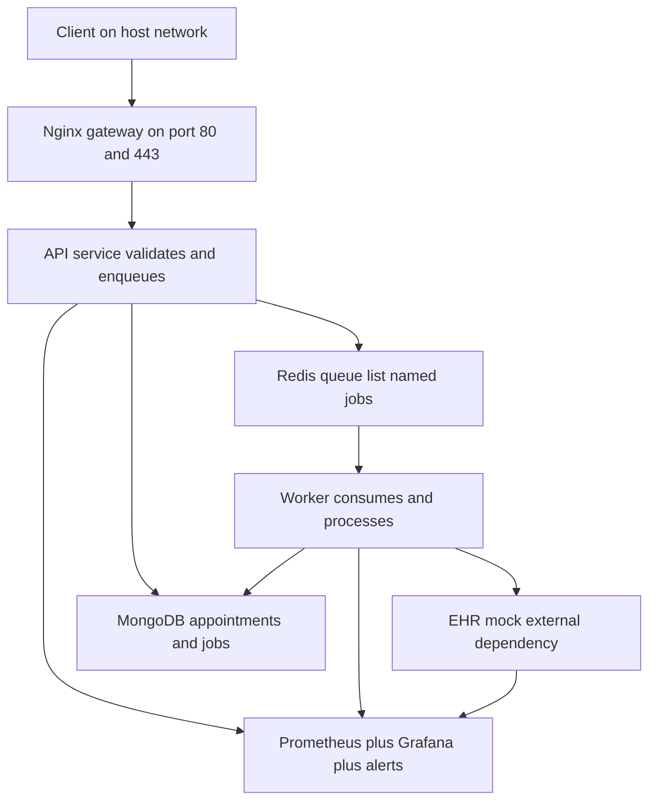
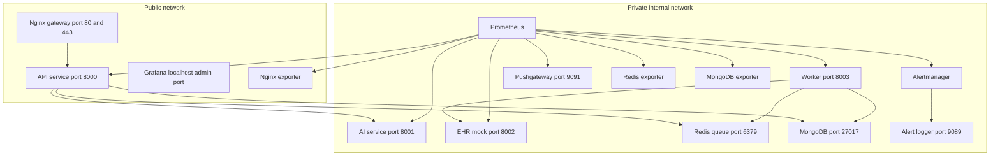
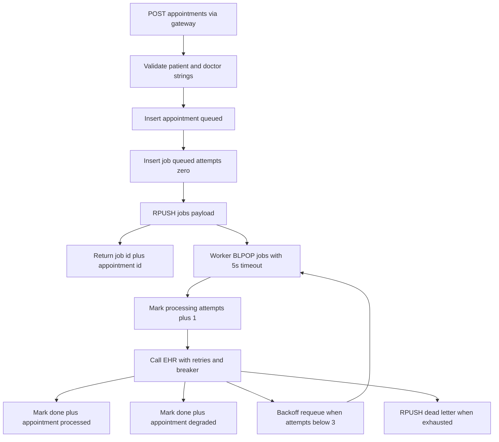
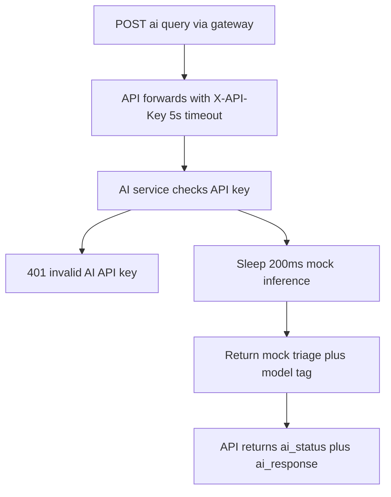
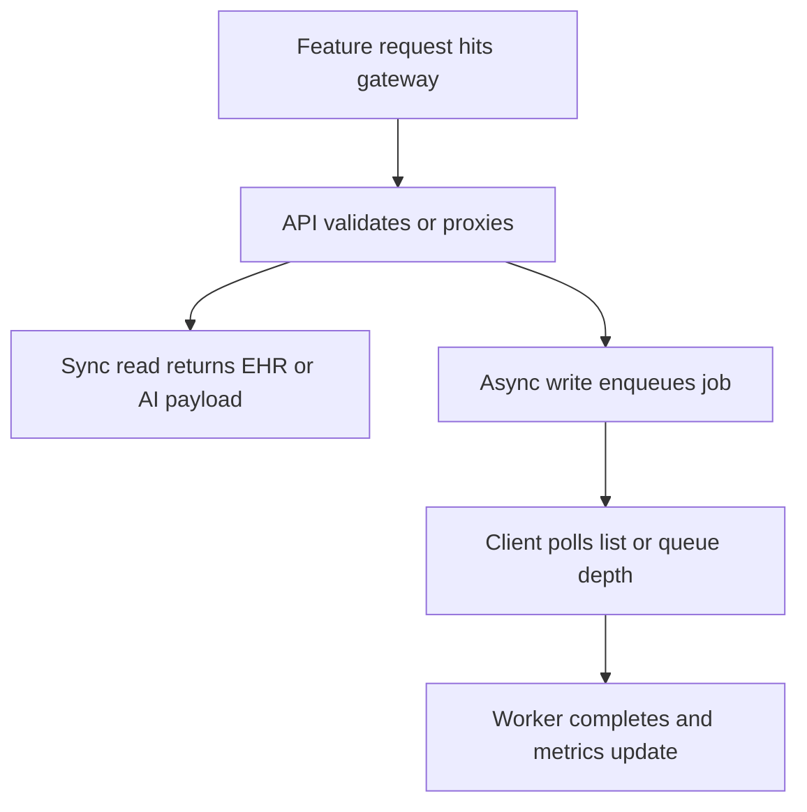
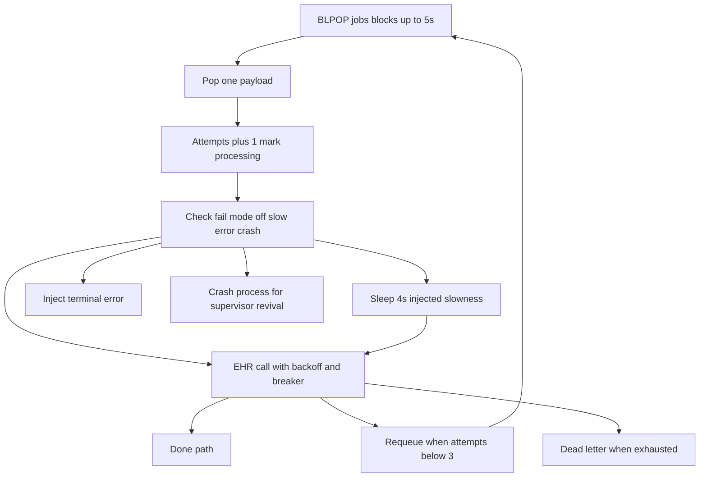
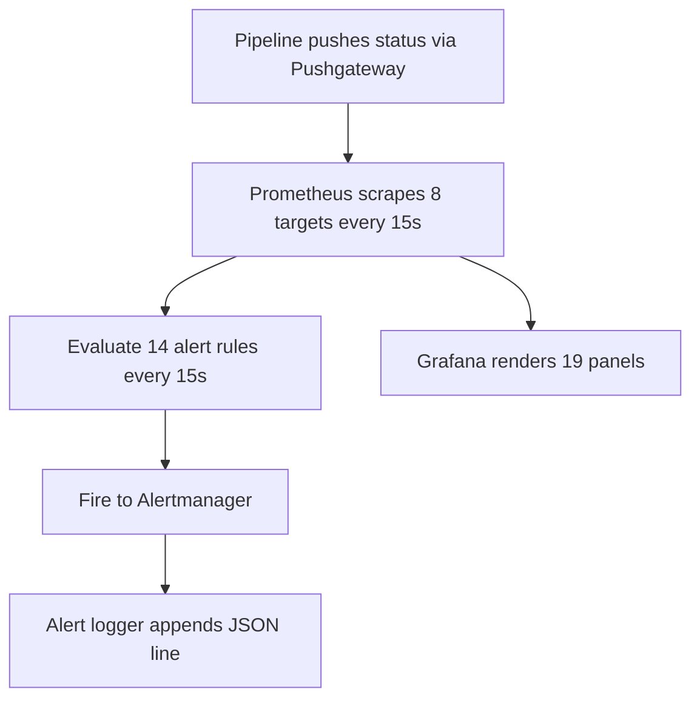
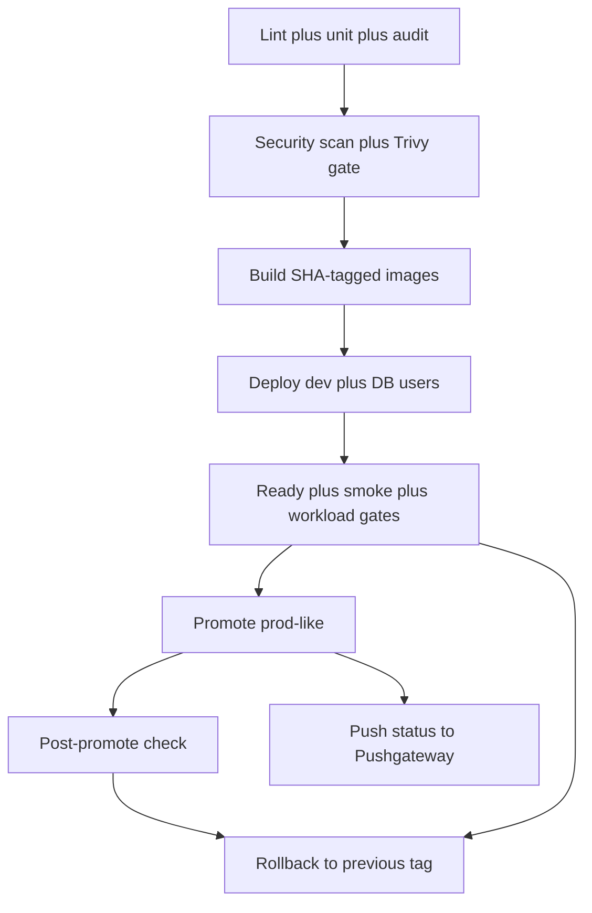

# AI Healthcare Cloud Infra Simulation — System Architecture

Local production-style simulation of secure, reliable, and scalable cloud infrastructure for an AI-powered healthcare platform. Built for the DevSecOps and Cloud Engineering assessment (Requirements v2.0). Local only — no public URL.

| Item | Detail |
|---|---|
| Stack | Node.js 22 plus Express (MERN backend, no frontend per spec), MongoDB 7, Redis 7 queue, Nginx gateway, Prometheus plus Grafana plus Alertmanager plus Pushgateway, Docker Compose, Terraform (doc-grade), GitHub Actions |
| Live URL | Local only — gateway on localhost 8080 (dev) or 8081 (prod-like), Grafana on 127.0.0.1 port 3000 or 3001 |
| AI model | No real AI — deterministic mock service (mock-llm-0.1) with shared-secret auth, 200 ms simulated inference |
| Verification | Unit 6 of 6, security-scan 32 passed 0 failed, compose-lint 81 passed 0 failed 4 warnings, k6 smoke 588 req 0 fail plus load 569 req 0 fail, 8 of 8 scrape targets, 14 alerts, 19 dashboard panels, 3 incident lifecycles, backup drill 1519 docs restored |

## Contents

1. Product Loop
2. Stack Rationale
3. System Architecture
4. Gateway Routes (No Frontend)
5. Backend Lifecycle
6. Services Table
7. DB Schema and Relationships
8. Auth and Isolation Model
9. Storage and Persistence
10. Appointment Processing Pipeline
11. AI-Mock Integration (No RAG)
12. Per-Feature Flows
13. Background Jobs
14. Observability and Evaluation
15. Error Handling, Retries, Idempotency, Rate Limits
16. Security and Performance
17. Admin and Operations
18. Deployment and Environment Variables
19. Testing and Verification Status
20. Trade-offs, Limitations, Future Work
21. Current Status (Exact)

Diagram convention note: all flowcharts read top to bottom; boundary nodes mark trust edges, service nodes are the runtime components, data nodes are deterministic persisted state, and action or observability nodes cover AI calls, queue events, alerts, and pipeline gates.

## 1. Product Loop

The core loop of the whole system is Client to Gateway to API to Queue to Worker to EHR to MongoDB to Observe. Every diagram in this document hangs off that loop.

The synchronous leg (Client to API response) only validates and enqueues, so mean latency stays near 16 ms. The asynchronous leg (Worker to EHR to MongoDB) carries all the failure modes, retries, and observability. Nothing is lost when a consumer dies because jobs persist in Redis and state persists in MongoDB.

## 2. Stack Rationale

| Choice | Why this and not an alternative |
|---|---|
| Node.js 22 plus Express for api, ai-service, worker, ehr-mock, alert-logger | MERN-backend requirement after the Python-to-Node port; one runtime for all custom services, stdlib-only test story with node:test, small images around 332 to 345 MB |
| MongoDB 7 | Document store for appointments and jobs; persisted named volume; per-service least-privilege users; deviation from relational ideal is documented with a Postgres plan |
| Redis 7 with AOF | Durable list used as the job queue plus dead-letter list; BLPOP blocking consume; queue-data volume survives restarts |
| Nginx gateway as sole ingress | Single public entry with rate limiting, TLS termination, dynamic DNS re-resolution, and failover across API replicas |
| Prometheus plus Grafana plus Alertmanager plus Pushgateway plus 3 exporters | FOSS observability as code: 8 scrape targets, 14 alert rules with runbooks, 19-panel dashboard, pipeline status via Pushgateway |
| Docker Compose base plus dev and prod env files | Env separation without duplication; dev on 8080 plus 8443, prod-like on 8081 plus 8444, side-by-side capable |
| Terraform doc-grade provider-less graph | Offline-planable resource graph (2 networks, 15 services) that mirrors Compose; Compose remains the executor |
| GitHub Actions pipeline twin plus local pipeline.sh | Identical stage order and gates in CI and locally; SHA tags make every container traceable to source |

## 3. System Architecture

Only the gateway publishes HTTP to the host. Grafana publishes a 127.0.0.1-bound admin port only. Everything else (AI service, worker, EHR mock, Redis, MongoDB, Prometheus, Alertmanager, Pushgateway, alert-logger, redis and mongodb exporters) lives on the private internal network with no host ports. API, Grafana, and the nginx exporter are dual-homed because Docker drops published ports and gateway adjacency for containers attached only to an internal network.

## 4. Gateway Routes (No Frontend)

There is no frontend in this project by spec section 26. The gateway is the entire presentation edge: it terminates TLS, sheds overload with 429s, and reverse-proxies to the API.

| Location | Purpose |
|---|---|
| Port 80 plus 443 with self-signed TLS 1.2 and 1.3 | Sole public listeners; cert created by scripts gen-gateway-cert.sh and mounted read-only |
| Path health | Proxied to API health; lightweight liveness through the edge |
| Path nginx-health | Static gateway liveness JSON; touches no upstream |
| Path nginx_status | stub_status allow-listed to localhost plus RFC1918, deny all; exporter only |
| Path catch-all | Proxied to API with rate limit 20 req per s plus burst 20 nodelay; carries ready, metrics, appointments, ai query, ehr paths |
| Resolver 127.0.0.11 valid 10s plus proxy_next_upstream tries 2 | Picks up rescheduled API containers without reload; fails over on 502 or 503 |

## 5. Backend Lifecycle

Every custom service exposes liveness, and the API additionally exposes readiness that fail-fasts on dependency loss.

| Service | Startup order | Liveness | Readiness or gating signal |
|---|---|---|---|
| MongoDB | First; healthcheck via mongosh ping | mongosh ping with root fallback | Healthy gate for API, worker, exporters |
| Redis queue | First; healthcheck via redis-cli ping | redis-cli ping | Healthy gate for API and worker |
| API | After DB plus queue healthy | GET health with version and db name | GET ready returns ready true or false with db and queue checks; gateway and pipeline gate on it |
| AI service | Anytime on private net | GET health | Prometheus up plus POST infer auth success rate |
| Worker | After DB plus queue healthy | GET health with breaker state | Prometheus up plus queue drain rate |
| EHR mock | Anytime on private net | GET health with default mode | EHR outcome mix in worker metrics |
| Prometheus | Anytime; 30 s start window for WAL replay | Path healthy | 8 of 8 targets up |
| Alertmanager plus alert-logger plus Pushgateway | Anytime | Path healthy or GET health | Alert delivery log plus pipeline gauges |

Restart policy is unless-stopped on every service, so crashes and OOM kills revive automatically while an explicit stop stays stopped (used deliberately for the INC-01 drill window).

## 6. Services Table

| Service | Image | Port | Role in one line |
|---|---|---|---|
| gateway | nginx alpine pinned by digest | 80 plus 443 | Sole ingress, TLS, rate limit, dynamic upstream failover |
| api | built ai-healthcare api | 8000 | Validate appointments, enqueue jobs, proxy AI and EHR reads |
| ai-service | built ai-healthcare ai-service | 8001 | Deterministic mock triage with shared-secret auth |
| worker | built ai-healthcare worker | 8003 | BLPOP jobs, call EHR with retries and breaker, persist outcomes |
| ehr-mock | built ai-healthcare ehr-mock | 8002 | Programmable external dependency with 7 failure modes |
| queue | redis 7 alpine pinned by digest | 6379 | Durable jobs list plus dead-letter list, AOF persisted |
| db | mongo 7 jammy pinned by digest | 27017 | healthcare database for appointments and jobs |
| prometheus | prom prometheus v3 pinned by digest | none published | 15 s scrape, 7 d and 1 GB retention, 14 rules |
| alertmanager | prom alertmanager pinned by digest | none published | Routes firing alerts to the alert-logger webhook |
| alert-logger | built ai-healthcare alert-logger | 9089 | File sink for alert notifications on a host bind mount |
| pushgateway | prom pushgateway pinned by digest | none published | Receives pipeline and security status pushes |
| grafana | grafana 11 pinned by digest | 127.0.0.1 bound | 19-panel dashboard, provisioned datasource and dashboard |
| redis-exporter | oliver006 redis_exporter pinned by digest | 9121 | Redis metrics, watched via up not container probe |
| mongodb-exporter | percona mongodb_exporter pinned by digest | 9216 | Mongo metrics as monitor_user, watched via up |
| nginx-exporter | nginx prometheus-exporter pinned by digest | 9113 | Gateway stub_status metrics, watched via up |

Service count is 15 total: 7 application plus 8 observability. All base images are digest-pinned.

## 7. DB Schema and Relationships

MongoDB database healthcare holds two collections. Redis holds the transient queue plus counters.

| Store | Collection or key | Key columns or fields | Indexes |
|---|---|---|---|
| MongoDB healthcare | appointments | id like appt-star, patient, doctor, status queued or processed or processed_ehr_degraded or failed_auth, createdAt | status plus createdAt |
| MongoDB healthcare | jobs | id like job-star, appointment_id, status queued or processing or done or failed, attempts, updatedAt | status plus updatedAt |
| Redis | jobs list | job_id plus appointment_id payloads via RPUSH and BLPOP | none (list order) |
| Redis | jobs dead list | exhausted payloads after 3 attempts | none (list order) |

Appointments and jobs relate one-to-one through appointment_id: each POST appointments insert creates one queued appointment and one queued job with attempts set to 0. The worker moves a job from queued to processing (attempts plus 1), then to done or failed, and flips the linked appointment to processed, processed_ehr_degraded, or failed_auth. Failed jobs with attempts below 3 are backoff-requeued; exhausted ones land in the dead-letter list for operator replay.

Least-privilege users are api_user (readWrite on healthcare), worker_user (readWrite on healthcare), and monitor_user (clusterMonitor on admin, zero app-data access, verified by a refused find probe). Fresh volumes get them from mongo-init.js; existing volumes get them idempotently from scripts create-db-users.sh.

## 8. Auth and Isolation Model

| Layer | Mechanism |
|---|---|
| Network segmentation | public net holds gateway, api, grafana, nginx-exporter; private net is internal true and holds everything; only gateway HTTP(S) plus localhost Grafana reach the host |
| Outbound proof | scripts check-outbound.sh passes 6 of 6 and 0 failed: private services cannot reach the AI port from outside, internal flag verified |
| Per-service DB credentials | api_user, worker_user, monitor_user with distinct passwords from the env file; rotation via scripts rotate-secrets.sh with rolling restart |
| AI shared secret | POST infer requires X-API-Key matching AI_API_KEY; mismatch returns 401 and increments the auth-fail counter |
| Container hardening | api, ai-service, worker, ehr-mock, alert-logger run as unprivileged node user, read-only root filesystem, tmpfs on tmp, cap_drop ALL, no-new-privileges |
| Secrets handling | Never hardcoded; .env.example documents keys with placeholders; real values live in git-ignored env files; secret scanning gates every release |
| Admin access | Grafana admin on 127.0.0.1 only; Prometheus and Alertmanager have no published ports at all |

## 9. Storage and Persistence

| Volume | Holds | Retention and rotation |
|---|---|---|
| mongodb_data | MongoDB data files | Survives down plus up; removed only by explicit volume rm; nightly mongodump with keep-5 via cron |
| queue-data | Redis AOF appendonly files | Survives restarts; full-state backup includes it with SHA256SUMS |
| prometheus-data | Prometheus TSDB WAL | 7 days or 1 GB retention cap |
| grafana-data | Grafana sqlite plus plugins | Survives restarts; dashboards themselves are provisioned from git |
| alert-notifications bind mount | alert-notifications.log JSON lines | Host-visible notification artifact, Loki stand-in |

The verified backup drill dumped 1519 documents, deleted 100, and restored to 1519 with 2938 duplicate skips and no drop flag. A disaster variant with drop plus full recreate is scripted separately.

## 10. Appointment Processing Pipeline

Validation failures return 422 with a patient-and-doctor detail message. Mongo or Redis failures return 503 without creating partial state visible to the client. The 200 response means accepted and queued, never processed — processing is strictly asynchronous.

## 11. AI-Mock Integration (No RAG)

This project has no embeddings, no vector store, and no retrieval pipeline. The AI surface is a deterministic mock behind the same gateway, and this section replaces the RAG section of the reference style.

POST infer truncates input to 200 chars and returns mock-triage text with model tag mock-llm-0.1. Unreachable AI degrades the API to 502 while queue and DB traffic continue unaffected; the AIUnavailable alert (up equals 0 for 1 minute) distinguishes outage from 401 spikes, which indicate a wrong key rather than downtime. AI-API-key handling, resource controls, service isolation, and inference-rate monitoring satisfy the assessment's AI-service infrastructure requirements without any real model.

## 12. Per-Feature Flows

### 12.1 Create appointment (async enqueue)

Client POSTs patient plus doctor JSON to the gateway catch-all. The API validates types, inserts the appointment and job documents, RPUSHes the payload, and returns job_id plus appointment_id with queued status. Measured baseline is about 16 ms average and 22 ms p95 for a 20-request workload.

### 12.2 List appointments

GET appointments with an optional limit capped at 100 returns id, patient, doctor, and status rows from MongoDB. It is a direct read with no queue involvement.

### 12.3 AI query (sync proxy)

POST ai query forwards the body to the AI service with the shared-secret header and a 5 s timeout, returning ai_status plus ai_response or a 502 fallback when the mock is unreachable.

### 12.4 EHR status read (sync proxy with timeout)

GET ehr status forwards to the EHR mock record endpoint with a configurable timeout (default 3 s), returning ehr_status, latency_ms, and body, or 504 on timeout. The slow mode sleeps 2 s deliberately to stay under the 3 s client budget; the timeout mode sleeps 10 s to force the abort path.

### 12.5 Health, readiness, metrics

GET health is liveness per service. GET ready on the API reports ready true or false with db and queue check detail and always returns 200 so the pipeline can distinguish fail-fast 503s on writes from probe semantics. GET metrics returns JSON counters while GET metrics prom returns Prometheus text for scraping.

## 13. Background Jobs

The only job system is the Redis jobs list consumed by the worker loop. There is no cron scheduler inside the stack; scheduled work (nightly dumps) lives in host cron.

Worker dials are WORKER_CONCURRENCY (2 dev, 4 prod-like), WORKER_FAIL_MODE (off, slow, error, crash for drills), EHR_MAX_ATTEMPTS 3, backoff base 1000 ms doubling to a max of 8000 ms, and breaker threshold 5 with a 15 s cooldown (closed to open to half-open probe to closed). A 401 from the EHR is terminal failed_auth with no retry and no breaker trip. Measured drain is about 3 jobs per s per worker: 375 jobs drained in about 105 s on one worker and 302 jobs in about 45 s on two workers (2.2 times linear).

## 14. Observability and Evaluation

Eight scrape jobs cover api, worker, ai-service, ehr-mock, nginx, redis, mongodb, and pushgateway. Fourteen alerts (5 critical, 9 warning) each carry summary, description, and runbook: APIUnavailable, HighErrorRate, ExcessiveLatency, WorkerDown, QueueBacklog, DBUnavailable, DeploymentFailed, SecurityScanFailed, EHROutage, ExporterDown, AIUnavailable, EHRMockDown, ConfigFailure, SaturationWarning. The 19-panel dashboard shows 7 stat singles (API, worker, Redis, Mongo, Nginx, pipeline OK, scan OK) and 12 time series (request rate, error rate, mean latency, worker processed-failed-retries, queue depth, EHR outcome mix, Redis ops plus clients, Nginx connections, deployment version, firing alerts, AI infer plus auth fails, EHR by mode). Evaluation is one command: bash scripts evaluate.sh exits 0 only if every check passes and can emit machine-readable JSON.

## 15. Error Handling, Retries, Idempotency, Rate Limits

| Concern | Behavior |
|---|---|
| API validation | 422 with detail when patient or doctor are not strings; no partial writes |
| Dependency failure on write | 503 when Mongo or Redis is unreachable; readiness fail-fast engages |
| AI unreachable | 502 fallback; queue and DB paths unaffected |
| EHR timeout | 504 after EHR_TIMEOUT_S; worker treats as retryable with backoff |
| Worker retries | Up to 3 attempts, exponential backoff 1 s doubling to 8 s cap |
| Circuit breaker | Opens after 5 consecutive EHR failures, half-open probe after 15 s cooldown |
| Terminal errors | EHR 401 becomes failed_auth immediately, no retry, no breaker count |
| Dead letter | Exhausted payloads go to jobs dead list with dead_total counter for replay |
| Idempotency | Job and appointment ids are server-generated unique ids; restores upsert without drop so replays skip duplicates |
| Rate limiting | 20 req per s per IP plus burst 20 nodelay at the gateway catch-all; excess gets 429 (verified by k6 burst probe); health and exporter paths exempt |
| Failover | proxy_next_upstream retries 502 or 503 across API replicas, up to 2 tries |

## 16. Security and Performance

Security-scan.sh reports 32 passed and 0 failed: non-root users on 4 of 4 custom Node images, minimal alpine or jammy bases, .dockerignore coverage, Trivy application-dependency gate with zero HIGH or CRIT (express 4.22.3, mongodb 6.21.0, ioredis 5.11.1), OS baseline 52 HIGH plus 4 CRIT report-only with no fix available, Gitleaks secret scan, and compose-lint 81 passed 0 failed 4 warnings. All deployable images are digest-pinned and tagged by git SHA for traceability. A seeded-secret demo proves a leaked credential blocks the release before deploy while dev keeps serving; a broken-ready demo proves the 120 s health gate times out and rolls back.

Performance baselines are k6 smoke with 588 requests and 0 failures (avg 11.1 ms, p95 39.8 ms) and k6 load with 569 requests and 0 failures (avg 7.1 ms, p95 17 ms), with latency independent of a 302-deep backlog. Container footprints are roughly api 49 MB, worker 35 MB, mongo 99 MB at runtime (dev under 400 MB plus monitoring near 150 MB). Prod-like applies CPU and memory caps to the scalable Node services only.

## 17. Admin and Operations

Operators work through 22 scripts: smoke and workload probes, autoscale on queue depth, canary with sampled probes and promote or rollback gates, backup plus verify plus restore for Mongo and full volumes, secret rotation with rolling restart, outbound isolation proof, log-bundle collection as the Loki stand-in, infra-plan snapshots, and supply-chain SBOM plus checkov plus k6 threshold gates. Grafana is the only visual admin surface and it is host-local. Three incident lifecycles are rehearsed end to end: worker stop with 30 banked jobs (WorkerDown firing near 1.5 min, drain 30 to 0 in about 22 s after restart), EHR unavailable with 171 degraded jobs (EHROutage firing, then 15 fresh jobs 100 percent OK after recovery), and MongoDB kill (ready false plus 503s, DBUnavailable near 1 min plus ConfigFailure near 2 min, then READY plus SMOKE after restart).

## 18. Deployment and Environment Variables

The pipeline twin runs identically locally (scripts pipeline.sh) and in CI (.github workflows pipeline.yml, green run 3 m 47 s): lint 6 OK, unit 6 of 6, audit, security 32 of 0, Trivy PASS, dev READY plus SMOKE plus workload, prod-like READY. Deploys snapshot the previous tag first; any gate failure restores it. prod-like additionally applies the resource-limit overlay file. Terraform dev and prod tfvars mirror the env files for the offline-planable graph.

| Variable | Dev | Prod-like | Purpose |
|---|---|---|---|
| COMPOSE_PROJECT_NAME | ai-healthcare-dev | ai-healthcare-prod | Network and volume namespace |
| APP_VERSION | 0.1.0-dev | 0.1.0 | Image tags and deployment_info gauge |
| GATEWAY_PORT | 8080 | 8081 | Host HTTP ingress per env |
| GATEWAY_TLS_PORT | 8443 | 8444 | Host HTTPS ingress per env |
| LOG_LEVEL | debug | info | Service log verbosity |
| MONGO_USER plus MONGO_PASSWORD | app plus dev secret | app plus prod secret | Mongo root bootstrap |
| MONGO_DB | healthcare | healthcare | Application database name |
| MONGO_API_USER plus PASSWORD | api_user plus dev secret | api_user plus prod secret | Least-privilege API credential |
| MONGO_WORKER_USER plus PASSWORD | worker_user plus dev secret | worker_user plus prod secret | Least-privilege worker credential |
| MONGO_MONITOR_USER plus PASSWORD | monitor_user plus dev secret | monitor_user plus prod secret | Exporter clusterMonitor credential |
| AI_API_KEY | dev key | prod key | AI service shared secret |
| EHR_TIMEOUT_S | 3 | 3 | EHR client timeout seconds |
| EHR_MODE | ok | ok | Default EHR failure mode |
| WORKER_CONCURRENCY | 2 | 4 | Advisory worker parallelism |
| WORKER_FAIL_MODE | off | off | Drill injection switch |
| GRAFANA_PORT | 3000 | 3001 | Localhost admin port per env |
| GRAFANA_ADMIN_USER plus PASSWORD | admin plus dev secret | admin plus prod secret | Dashboard login |

## 19. Testing and Verification Status

| Gate | Result |
|---|---|
| Unit (node:test, no deps) | 6 of 6 pass for appointment validation |
| Lint (node check, 7 files) | 6 OK across api, ai-service, worker, ehr-mock, alert-logger |
| security-scan.sh | 32 passed, 0 failed |
| compose-lint.py | 81 passed, 0 failed, 4 warnings |
| check-outbound.sh | 6 passed, 0 failed isolation proof |
| smoke.sh | SMOKE OK on dev and prod-like |
| workload.py 20 creates | avg near 16 ms, p95 near 22 ms, queue drains to 0 |
| k6 smoke (5 VUs, 60 s) | 588 requests, 0 failed, avg 11.1 ms, p95 39.8 ms |
| k6 load (ramp to 12, 85 s) | 569 requests, 0 failed, avg 7.1 ms, p95 17 ms, QueueBacklog fired and cleared |
| k6 burst (40 VUs, 400 iter) | 429s observed as designed, gateway stays healthy |
| Prometheus targets | 8 of 8 up |
| Grafana dashboard | 19 panels provisioned |
| Alert rules | 14 loaded with runbooks |
| Incidents | 3 lifecycles rehearsed with firing and resolve timestamps |
| Backup drill | 1519 docs dumped, 100 deleted, 1519 restored, verify 8 of 8 OK |
| Pipeline evidence | 6 logged runs including healthy PASS, blocked-secret, and broken-ready rollback |
| CI | Green Actions run on push to main with ephemeral dev plus prod-like projects |

## 20. Trade-offs, Limitations, Future Work

| Decision or limit | Trade-off and follow-up |
|---|---|
| MongoDB instead of relational | Faster simulation iteration, but the assessment implies relational semantics; POSTGRES-PLAN.md stages the migration |
| Nginx OSS variable proxy_pass DNS | No gateway reload needed, but no per-request round-robin inside a 10 s window (measured 40 of 40 to one replica); scale workers not API, or adopt a real ingress |
| No cadvisor or Loki | SaturationWarning uses queue depth plus latency as a proxy; log bundles stand in for centralized logging |
| Scratch exporters without probes | Honest up-based alerting via ExporterDown instead of lying container healthchecks |
| Self-signed gateway TLS | Fine for local simulation; a real edge needs ACME plus HSTS |
| Mock AI with shared secret | Proves secret handling and isolation without model cost; a real provider needs key rotation plus inference SLOs |
| Single-host Compose | The host is the ultimate SPOF; cost is zero euros with dev under 400 MB; cloud migration needs multi-AZ plus managed data plus HPA |
| Terraform provider-less | Offline plan without credentials, but Compose executes; a cloud port needs real providers plus state backend |

## 21. Current Status (Exact)

Phases 1 through 4 are done and re-validated after the MERN port on 2026-09-19: foundation plus hardening plus DevSecOps pipeline plus observability with load evidence and incident lifecycles. The working tree serves dev on 8080 and prod-like on 8081 from the same base file with per-env overrides. All gates listed in section 19 pass. No code changes are pending; the documented next steps are the Postgres migration, real-ingress round-robin, centralized logging, and cloud-provider Terraform backends.
