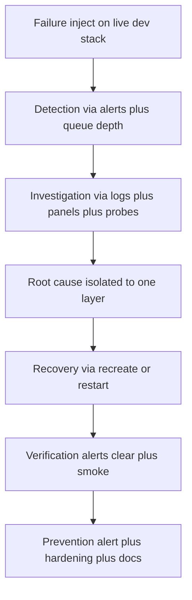
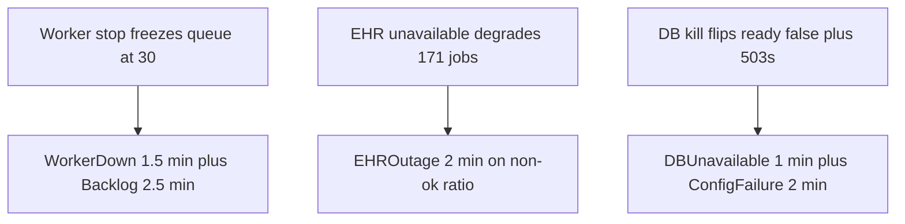
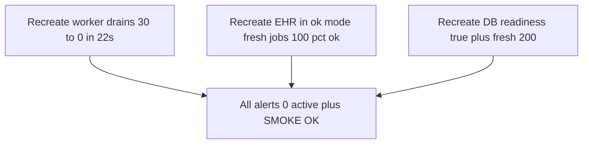

# Incident Report — AI Healthcare Cloud Infra Simulation

Local production-style simulation of cloud infrastructure for an AI healthcare platform. This report documents three intentional operational failures run end to end on the live dev stack — each through Failure to Detection to Investigation to Root Cause to Recovery to Verification to Prevention — with the worker outage as the fully detailed primary incident. Local only — no public URL.

| Item | Detail |
|---|---|
| Environment | Dev stack on localhost 8080 with Prometheus plus Grafana plus Alertmanager up, queue drained to 0 |
| Incidents | INC-01 worker stop (full detail), INC-02 EHR outage (condensed), INC-03 database kill (full lifecycle) |
| Detection | Prometheus alerts (WorkerDown, QueueBacklog, EHROutage, DBUnavailable, ConfigFailure) plus Grafana panels |
| Data loss | Zero across all three incidents; no operator data repair needed |
| Verification | All alerts resolved to 0 active series plus SMOKE OK after each recovery |

## Contents

1. Incident Lifecycle
2. INC-01 Worker Failure (Full Report)
3. INC-02 EHR Outage (Condensed Lifecycle)
4. INC-03 Database Connectivity Loss (Full Lifecycle)
5. Detection Signals Compared
6. Recovery Mechanics Compared
7. Prevention Backlog
8. Reproducibility Checklist
9. Current Status (Exact)

Diagram convention note: all flowcharts read top to bottom; boundary nodes mark trust edges, service nodes are the runtime components, data nodes are deterministic persisted state, and action or observability nodes cover failure injection, alerts, investigation steps, and recovery commands.

## 1. Incident Lifecycle

Every incident in this report follows the same operational loop, and the telemetry for each stage is named explicitly so an evaluator can replay it.

Two independent signals confirm each incident (liveness plus symptom), which is what separates a down process from a slow dependency: WorkerDown plus QueueBacklog for the worker, outcome-mix plus EHROutage for the EHR, exporter-liveness plus api_ready for the database.

## 2. INC-01 Worker Failure (Full Report)

### Failure (17:23:42)

Stopped the single worker while the system was serving, standing in for a crash or OOM-kill. Compose restart unless-stopped revives a real crash (verified via host-PID kill with sub-second restart and automatic drain); the explicit stop holds the process down so the detection window stays observable. Thirty jobs were then enqueued: average API latency stayed 6.5 ms with p95 8.2 ms — producers are decoupled from consumers, enqueueing never blocks on processing. All 30 jobs sat in Redis; none were lost.

### Detection

| Time | queue_depth | WorkerDown | QueueBacklog |
|---|---|---|---|
| 17:24:58 | 30 | pending | pending |
| 17:25:29 | 30 | firing | pending |
| 17:25:59 | 30 | firing | pending |
| 17:26:29 | 30 | firing | firing |
| 17:26:59 | 30 | firing | firing |

WorkerDown fired about 1.5 minutes after the stop (1-minute for plus 15-second scrape); QueueBacklog fired about 2.5 minutes after (depth above 15 for 2 minutes). The frozen depth of exactly 30 across five consecutive polls is itself evidence: jobs unacknowledged in Redis, nothing processed, nothing dropped.

### Investigation

Service listing showed the worker gone (stopped containers hide from default output); worker logs showed only routine history with no crash trace — the process was simply absent, as expected. The last log line (an EHR timeout on an earlier job) was correctly dismissed as noise: timeouts are routine and retried. Queue depth frozen plus absent process plus firing liveness alert triangulated the fault to the consumer, not the API, the queue, or the database.

### Root cause

Worker process absent (simulated crash). Two contributing design facts, both pre-existing and now telemetry-backed: a single worker drains about 3 jobs per second, so any outage accumulates backlog linearly; and before Phase 4 there was no liveness or backlog alerting — this exact failure was proven recoverable in Phase 1 but would have been silent until a user complained.

### Recovery (17:27:37)

Recreated the worker with up -d. Backlog drained 30 to 0 in about 22 seconds with zero operator data repair: unacknowledged Redis jobs resumed exactly where they stopped.

### Verification

WorkerDown plus QueueBacklog series returned to 0 active (both resolved), and the gateway smoke suite reported SMOKE OK with 1248 requests, 0 errors, and queue depth 0.

### Prevention

Restart unless-stopped on all services revives crashes without humans. WorkerDown (liveness) plus QueueBacklog (symptom) alerts now cover detection — this incident is the proof they fire and resolve. Drain-rate headroom (~3 jobs per s per worker, linear with scale) plus the backlog threshold of 15 buys roughly 5 seconds of reaction time per worker at typical arrival rates.

## 3. INC-02 EHR Outage (Condensed Lifecycle)

### Failure (17:29:04)

Recreated the EHR mock in unavailable mode: the dependency is logically down while its container stays healthy. Direct probe returned ehr_status 503 with retryable true. The critical nuance, checked immediately: the EHR container health endpoint still returned 200. Container health checks cannot see this failure — only the worker outcome telemetry can.

### Detection

Four paced workload batches plus 90 paced creates kept outage traffic flowing for about six minutes. The worker outcome mix moved to 80 unavailable_503 against a pre-outage baseline of 31 ok, and EHROutage went pending to firing at about 17:36 (non-ok ratio above 20 percent for 2 minutes). Exact outage footprint from MongoDB: 171 appointments in processed_ehr_degraded. A transient API latency blip in one batch (avg 21.8 ms vs 8–9 ms siblings) under coincident worker-DB write contention was noted but not isolated further.

### Investigation, root cause, recovery, verification, prevention

The Grafana EHR-outcome-mix panel showed unavailable_503 dominant with all other results flat; worker logs showed no errors — by design, EHR 5xx degrades the job rather than failing it; the healthy EHR container placed the fault beyond our process boundary (external dependency, not internal bug), so recovery touched nothing but the dependency: recreate with EHR_MODE ok at 17:36:22. Fifteen fresh jobs then went 100 percent ok, EHROutage resolved at 17:40:52 as the rate window slid past the burst, and smoke plus queue drain confirmed. Prevention distinguishes 401 (terminal credential fault, no retry) from 503, 5xx, and timeouts (retryable dependency faults) as separate outcome labels with separate runbooks, backed by the permanent outcome-mix panel and the P1.2 breaker (opens after 5 consecutive retryable failures, 15 s cooldown, half-open probe; at most 3 EHR attempts with 1 s and 2 s backoff).

## 4. INC-03 Database Connectivity Loss (Full Lifecycle)

### Failure and detection

Killed the single MongoDB container (stands in for host failure, partition, or bad credential rotation). Detection was immediate and two-channel: GET ready flipped to ready false naming db fail with queue ok (fail-fast, HTTP 200 per the pipeline contract), DBUnavailable fired at about 1 minute (exporter liveness), and ConfigFailure (api_ready equals 0 for 2 minutes) went pending at 83 seconds and firing by about 2 minutes.

### Investigation

The ready detail named the dependency — no guessing which datastore was at fault. Creates during the outage returned 503 (verified live): fail loudly, never silently drop. The queue stayed intact and the worker idled without crashing. Alert series plus container status formed the evidence pair.

### Root cause, recovery, verification, prevention

Database process absent (simulated host failure). The contributing design fact is explicit: a single Mongo instance with no replica set — an accepted Compose-scope boundary, mitigated by named volume plus backup drill. Recovery recreated the database container; readiness returned true, a fresh appointment queued with 200, depth stayed 0, and smoke passed (the single errors_total of 1 is the expected 503 inside the window — proof the fail-fast path engaged). Zero data repair: the named volume survived, and least-privilege users reconnected without credential changes. Prevention rests on the two alerts proven here, the daily mongodump cron plus full-state volume backups with checksums plus the full-disaster recreate variant, and the documented replica-set upgrade path.

## 5. Detection Signals Compared

| Incident | Liveness signal | Symptom signal | Time to fire |
|---|---|---|---|
| INC-01 worker stop | WorkerDown (scrape up equals 0) | QueueBacklog (depth above 15) | 1.5 min plus 2.5 min |
| INC-02 EHR outage | None (container stays healthy) | EHROutage (non-ok above 20 pct) | About 2 min of sustained traffic |
| INC-03 DB kill | DBUnavailable (exporter plus up) | ConfigFailure (api_ready equals 0) | 1 min plus 2 min |

INC-02 is the shape that justifies outcome telemetry: when the container is healthy but the dependency is logically dead, only the worker EHR-outcome mix can see it.

## 6. Recovery Mechanics Compared

| Incident | Recovery command class | What resumed automatically | Operator data repair |
|---|---|---|---|
| INC-01 worker stop | Recreate worker | Unacknowledged Redis jobs | None |
| INC-02 EHR outage | Recreate EHR mock in ok mode | Fresh jobs 100 percent ok; degraded rows stay as history | None |
| INC-03 DB kill | Recreate database | Volume state plus least-privilege reconnects | None |

No rollback, no restore, and no replay were needed in any of the three: persistence (Redis AOF, Mongo volume) plus fail-fast semantics (503s, degraded states) carried the full load. Restore tooling exists for the harder case — actual data loss — and is drilled separately.

## 7. Prevention Backlog

| Prevention | Covers | Status |
|---|---|---|
| restart unless-stopped on all services | Crash revival without humans | Done, verified by kill test |
| WorkerDown plus QueueBacklog alerts | Worker outage detection | Done, proven by INC-01 |
| EHROutage plus outcome-mix panel | Logical dependency outage | Done, proven by INC-02 |
| DBUnavailable plus ConfigFailure alerts | Database and config failure | Done, proven by INC-03 |
| Breaker plus bounded retries plus terminal 401 | EHR retry storms and poison loops | Done (P1.2), replay-verified |
| Daily mongodump plus volume backups plus disaster recreate | Data loss beyond process death | Done, drilled (1519 docs round-trip) |
| Drain-rate headroom docs plus autoscale script | Backlog growth under load | Done, measured linear scaling |
| Replica set plus point-in-time recovery | Single-instance SPOF | Planned, documented upgrade path |

## 8. Reproducibility Checklist

- Dev stack plus monitoring up, queue at 0, note wall-clock start.
- INC-01: stop worker, run 30-create workload, poll queue plus alert series, recreate worker, confirm drain to 0, alerts clear, smoke.
- INC-02: recreate EHR mock in unavailable mode, sustain creates about 4 minutes, watch EHROutage fire, count degraded rows, recreate in ok mode, confirm ok outcomes resume, alert resolves, smoke.
- INC-03: kill database, confirm ready false plus 503 on create, watch DBUnavailable fire near 1 minute and ConfigFailure near 2 minutes, recreate database, confirm ready true, fresh create 200, alerts resolve, smoke.
- Expected timings: WorkerDown about 1.5 min, QueueBacklog about 2.5 min, EHROutage about 2 min of sustained non-ok ratio, DBUnavailable about 1 min, ConfigFailure about 2 min, resolution within 6 min of recovery.

## 9. Current Status (Exact)

Three incidents rehearsed end to end on 2026-09-19 with firing and resolve timestamps, alert evidence, and log excerpts in docs INCIDENTS.md. Zero data loss and zero manual repair in all three. Detection pairs (liveness plus symptom) proven to fire and resolve; prevention rows either done and drill-backed or explicitly planned with an owner document. No incident follow-ups are pending except the replica-set upgrade path, which is a scoped future phase rather than an open defect.
