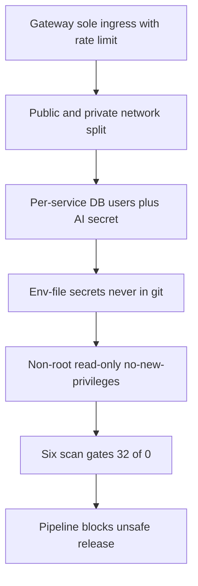
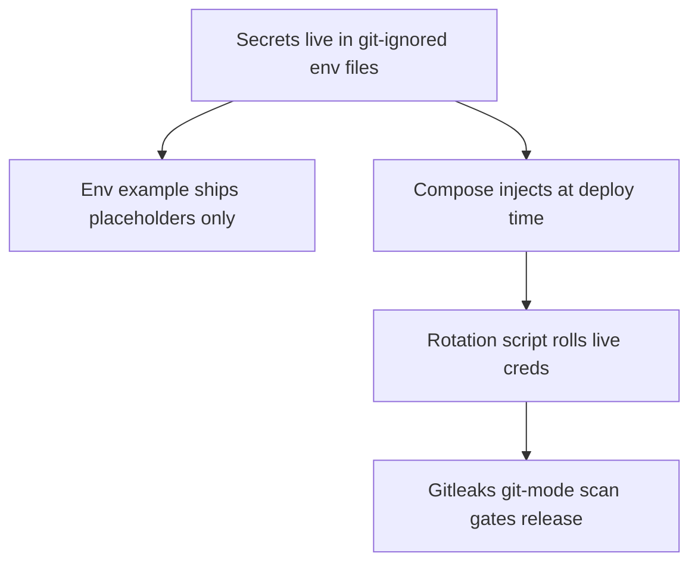
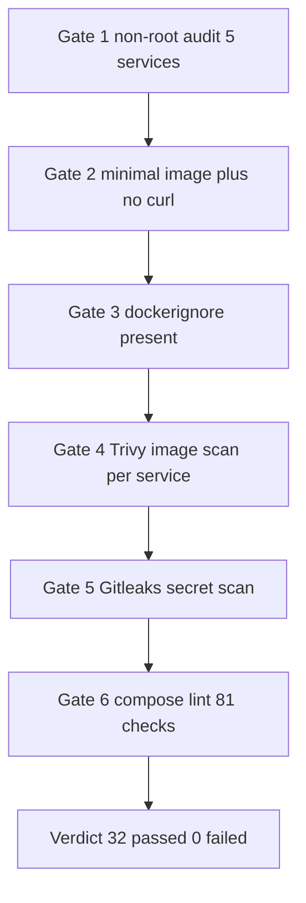
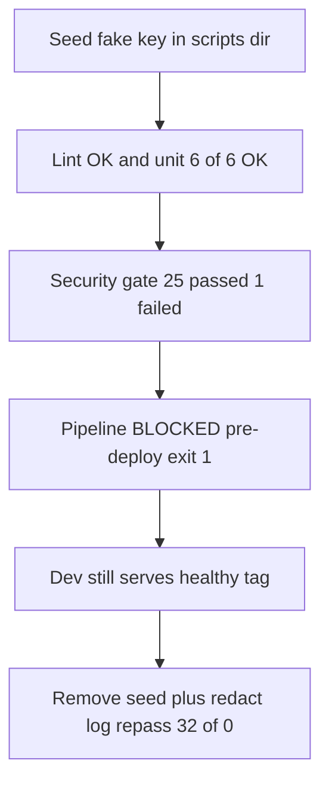

# Security Report — AI Healthcare Cloud Infra Simulation

Local production-style simulation of secure cloud infrastructure for an AI healthcare platform. This report documents the security checks performed, findings discovered, severity and impact, remediation applied, and evidence that the controls work — including a demonstrated security failure that blocked an unsafe release. Local only — no public URL.

| Item | Detail |
|---|---|
| Scope | 15 services (5 custom Node.js plus gateway, MongoDB 7, Redis 7, 8 observability), 2 networks, 2 environments |
| Gate command | bash scripts security-scan.sh |
| Gate result | 32 passed, 0 failed (26 of 0 before alert-logger joined the gates) |
| Pipeline demos | Healthy rollout PASS, seeded-secret release BLOCKED pre-deploy, broken-ready rolled back post-deploy |
| Live URL | Local only — gateway on localhost 8080 (dev) or 8081 (prod-like) |

## Contents

1. Security Layers
2. Network Security
3. Identity and Access (Least Privilege)
4. Secrets Management
5. Container and Runtime Security
6. Infrastructure Security Validation
7. Scan Gates and Evidence
8. Findings Fixed
9. Remaining Risks (Accepted)
10. Security Failure Demo (Blocked Release)
11. Pipeline Security Wiring
12. Current Posture (Exact)

Diagram convention note: all flowcharts read top to bottom; boundary nodes mark trust edges, service nodes are the runtime components, data nodes are deterministic persisted state, and action or observability nodes cover scans, gates, alerts, and pipeline verdicts.

## 1. Security Layers

Defense is layered so that no single control carries the whole posture: network segmentation contains, least-privilege identities limit, secret hygiene prevents leaks, hardened runtimes shrink impact, scans detect drift, and pipeline gates enforce.

Each layer is verified independently: isolation by check-outbound.sh (6 of 6), identities by live negative probe, secrets by Gitleaks in git mode, runtime by Dockerfile plus runtime-user audit, and enforcement by the seeded-secret block demo in section 10.

## 2. Network Security

| Control | Implementation |
|---|---|
| Sole ingress | Only the gateway publishes host ports (HTTP 8080 or 8081 plus TLS 8443 or 8444); every other service has no host port |
| Segmentation | public net holds gateway, api, grafana, nginx-exporter; private net is internal true and holds everything else |
| Admin restriction | Grafana binds 127.0.0.1 only (documented compose-lint exception); Prometheus and Alertmanager publish nothing |
| Exporter path guard | Gateway nginx_status allow-listed to localhost plus RFC1918, deny all |
| Outbound proof | scripts check-outbound.sh passes 6 of 6 with 0 failed: private services refuse direct external access, internal flag verified |
| Rate shedding | 20 req per s per IP plus burst 20 nodelay at the catch-all; excess gets 429, verified by the k6 burst probe |
| Encrypted edge | Self-signed TLS 1.2 and 1.3 on the gateway from a git-ignored local keypair |

## 3. Identity and Access (Least Privilege)

| Identity | Scope | Verified how |
|---|---|---|
| api_user | readWrite on healthcare only | Serves all API reads and writes; cannot touch admin |
| worker_user | readWrite on healthcare only | Consumes queue, persists outcomes; cannot touch admin |
| monitor_user | clusterMonitor on admin only | Reads serverStatus and top metrics for the exporter |
| AI_API_KEY shared secret | POST infer requires X-API-Key header | Wrong key returns 401 invalid AI API key and increments the auth-fail counter |
| Grafana admin | Dashboard login via placeholder env vars | Localhost-only access |
| Mongo root | DB init plus rotation scripts only | Never embedded in service URIs |

The negative probe proves the boundary: a find on healthcare appointments as monitor_user is refused with not authorized. Fresh volumes receive the three users from db mongo-init.js; existing volumes receive them idempotently from scripts create-db-users.sh. Rotation is live via scripts rotate-secrets.sh with rolling restart.

## 4. Secrets Management

Secrets never appear in application source, container images, infrastructure code, public configuration, or version control. Real values live in git-ignored per-env files; .env.example documents keys with placeholders. The gateway TLS keypair is generated locally and git-ignored. Gitleaks runs in git mode (history plus diffs) with one documented path-plus-rule allowlist for a proven false positive (a shell variable reference in rotate-secrets.sh matching the curl-auth-user shape — no literal credential exists in the file; generic entropy rules stay active on it).

## 5. Container and Runtime Security

| Control | Coverage |
|---|---|
| Non-root user | 5 of 5 custom Node images set USER node, verified at runtime via docker inspect |
| Minimal base | Multi-stage node 22-slim, both stages digest-pinned; runtime stage strips npm, corepack, npx, and curl |
| No curl in images | Healthchecks use language-native clients (node fetch); 5 of 5 Dockerfiles audited |
| Privilege containment | cap_drop ALL plus no-new-privileges on all 5 custom services |
| Read-only root FS | api, worker, ai-service, ehr-mock run read_only true with writable tmpfs on tmp; evaluated in a throwaway container before enforcing (health OK, create 200, write to app refused, write to tmp OK) |
| Dockerignore | 5 of 5 services exclude node_modules, git, env files, environments, docs |
| Image sizes | api 345 MB, worker 339 MB, ai plus ehr 332 MB; infra nginx 93 MB, redis 58 MB, mongo 1.18 GB |
| Documented exceptions | gateway root (upstream nginx design), db plus queue without cap_drop (proven chown requirement), each with network-level mitigation |

## 6. Infrastructure Security Validation

The compose lint (stdlib-only, 81 pass, 0 fail, 4 warnings) plus the scan script map one-to-one onto the required validation checklist:

| Required check | Tool and result |
|---|---|
| Public exposure of private resources | Lint asserts sole public port is gateway; Grafana localhost-bound is warn-only exception |
| Overly permissive access | Per-service DB users plus negative probe; no privileged or host-mode containers |
| Dangerous network rules | private internal true asserted; no cap_add; stub_status allow-listed |
| Hard-coded secrets | Gitleaks git mode clean; placeholders only in tracked files |
| Insecure infrastructure configuration | 81 lint assertions over compose topology, ports, volumes, restart policy |
| Weak container configuration | Non-root, slim base, dockerignore, read-only FS audits |
| Vulnerable dependencies or images | Trivy per-image reports plus binding trivy-gate on app deps |

## 7. Scan Gates and Evidence

Trivy semantics are split by design: app dependencies (lang-pkgs — express 4.22.3, mongodb 6.21.0, ioredis 5.11.1) carry zero HIGH or CRITICAL findings and gate the pipeline as blocking; the Debian bookworm OS layer carries 52 HIGH plus 4 CRITICAL with no upstream fix and is report-only (accepted risk R1, mitigated by non-root, dropped capabilities, and private networking). Evidence artifacts live in docs security-evidence: trivy reports per service, gitleaks.txt with no leaks found, and compose-lint.txt. The prior Python-stack snapshot is preserved separately for audit continuity.

## 8. Findings Fixed

| ID | Finding | Severity | Remediation | Verified |
|---|---|---|---|---|
| F1 | Python deps with 3 HIGH (fastapi stack) | High | Bumped to fixed releases | Trivy 0 on app deps |
| F2 | curl baked into custom images | Medium | Removed; native-client healthchecks | Audit 5 of 5 clean |
| F3 | Missing dockerignore | Medium | Added to all services | Check 5 of 5 present |
| F4 | No privilege containment | High | cap_drop ALL plus no-new-privileges | Runtime inspected; queue revert documented with cause |
| F5 | npm toolchain CVEs in node image (10 HIGH plus 1 CRITICAL) | Critical | Multi-stage build, toolchain stripped from runtime | Trivy node-pkg section gone; node version and healthchecks OK |
| R5-half | Unpinned base images | Medium | All bases digest-pinned plus trivy-gate added | Scan still PASS after pinning |
| G1 | Stale Gitleaks report re-tripping scans | Low | Delete stale report before scanning | Re-verified PASS, no allowlists |
| G2 | Exporter using root DB credential | High | monitor_user with clusterMonitor | Negative find probe refused |
| G3 | Writable root filesystem | Medium | read_only true plus tmpfs on tmp | Throwaway evaluation then 4 new lint checks |

## 9. Remaining Risks (Accepted)

| ID | Risk | Impact | Mitigation |
|---|---|---|---|
| R1 | OS layer 52 HIGH plus 4 CRIT, no fix available | Low exploitable (needs local foothold) | Non-root, dropped caps, private net, no shell tooling; rebuild cadence |
| R2 | Gateway runs as root | Upstream nginx design | Official minimal image, read-only config, sole port |
| R3 | db plus queue without cap_drop | Proven init requirement | Internal network, no host ports |
| R4 | Placeholder credentials in tracked env files | Non-production values | Gitleaks-clean; real secrets injected before shared use |
| R6 | MongoDB SSPL licensing | License posture only | Swap path documented if strict OSI required |
| R7 | Node images larger than Python ones | Disk only | Multi-stage applied; small vs infra images |

## 10. Security Failure Demo (Blocked Release)

The assessment requires proof that a failed security check prevents an unsafe deployment. A clearly labelled fake private key was seeded, and the pipeline stopped before building:

The Gitleaks failure fired inside security-scan.sh as-is (no stage reimplementation), so build and deploy were never reached, and the running dev tag stayed healthy throughout. Post-demo hygiene removed the seed, redacted the embedded key text from the evidence log (counts and fingerprints intact), and re-verified a strict PASS with no allowlists added. A second demo (broken readiness) separately proves post-deploy rollback: the 120 s health gate timed out and restored the previous tag.

## 11. Pipeline Security Wiring

Security runs in the pipeline in three places: security-scan.sh as-is (lint plus unit plus audit precede it), trivy-gate.sh as a binding exit-code gate on newly built images (app-dep HIGH or CRITICAL stops the run before deploy), and Pushgateway status pushes (pipeline_last_run_success, security_scan_last_success) feeding the DeploymentFailed and SecurityScanFailed Alertmanager rules plus the Grafana stat panels. CI (.github workflows pipeline.yml, green run 3 m 47 s) mirrors the local script stage for stage with SHA tags. There are no skip flags — gates that can be skipped are not gates.

## 12. Current Posture (Exact)

Gate result is 32 passed and 0 failed, re-verified after every Phase 4 change including the alert-logger service, digest-pinned observability images, read-only filesystems, and exporter least-privilege. OS baseline (52 HIGH plus 4 CRITICAL, no fix) is reported on every run and stays non-blocking by explicit decision; every app-dependency finding would block. The seeded-secret and broken-ready demos prove both the pre-deploy block and the post-deploy rollback paths with logs in docs pipeline-evidence. No code changes are pending on the security side; open levers are rebuild cadence, distroless evaluation, and the Postgres migration path.
